# -TravelDestinationApp

Repository kumpulan tugas magang di Crocodic Semarang. Setiap tugas/fitur dikerjakan pada branch terpisah sesuai nama fiturnya, lalu di-push ke repository ini.

| Branch | Fitur | Status |
|---|---|---|
| `main` | Halaman utama repository | - |
| `login-register` | Halaman Login & Register dengan ConstraintLayout + MySQL | Selesai |
| `Tugas-3-Implementasi-Pagination` | Daftar destinasi wisata Semarang dengan pagination | Selesai |
| `Tugas-4-Implementasi-Fitur-Search-Detail` | Pencarian destinasi wisata & halaman detail destinasi | Selesai |
| `Tugas-5-Implementasi-Bottom-Navigation-Fragment-Splash-Screen-Logout` | Bottom Navigation, Fragment, Splash Screen, Session Login & Logout | Selesai |
| `Tugas-6-Menambahkan-Fitur-Favorit-Wisata-dengan-Room-Database` | Favorit Wisata dengan Room Database (Entity, DAO, Database, Repository, ViewModel) | Selesai |
| `Tugas-7-Implementasi-Backend-API-CRUD-Layouting` | Implementasi Backend API CRUD & Layouting (Create, Read, Update, Delete) | Selesai |
| `Tugas-8-Implementasi-API-CRUD-Wisata-pada-Aplikasi-Android` | Implementasi API CRUD Wisata dengan MVVM + Repository, Alert Dialog konfirmasi hapus, serta penanganan Loading, Success, Error, dan Data Kosong | Selesai |

Seluruh tangkapan layar pada dokumen ini diambil ulang memakai tampilan aplikasi terkini, yaitu setelah aplikasi memakai identitas **Jelajah Jateng**. Jadi fitur dari tugas sebelumnya pun terlihat dengan warna dan tata letak yang berlaku sekarang.

---

# Branch `Tugas 8 – Implementasi API CRUD Wisata pada Aplikasi Android`

## Deskripsi

Melanjutkan pengembangan **TravelDestinationApp** dengan merapikan dan melengkapi fitur **CRUD (Create, Read, Update, Delete)** data wisata agar seluruh prosesnya berjalan melalui **API** dan tersusun memakai arsitektur **MVVM + Repository**.

Jika pada Tugas 7 fokusnya adalah membangun Backend API PHP beserta layouting halamannya, maka pada Tugas 8 fokusnya berpindah ke **sisi aplikasi Android**: memastikan setiap proses CRUD melewati alur yang benar (Activity/Fragment → ViewModel → Repository → API), serta memastikan pengguna selalu mendapat kabar yang jelas ketika proses sedang berjalan, berhasil, gagal, maupun ketika datanya memang kosong.

- **Create**: Menambahkan data wisata baru lewat form pada halaman **Tambah Data Wisata** (`AddWisataActivity`). Setelah tombol **Simpan** ditekan, data dikirim ke API melalui `AddWisataViewModel` → `WisataRepository`.
- **Read**: Mengambil daftar wisata dari API lalu menampilkannya pada **RecyclerView** di Home Fragment, serta menampilkan satu data lengkap pada halaman **Detail Wisata**.
- **Update**: Mengubah data wisata yang sudah ada lewat halaman **Edit Data Wisata** (`EditWisataActivity`). Form terisi otomatis dengan data lama, lalu perubahannya dikirim kembali ke API.
- **Delete**: Menghapus data wisata melalui API. Sebelum data benar-benar dihapus, aplikasi **wajib menampilkan Alert Dialog** sebagai konfirmasi supaya data tidak terhapus karena salah tekan.

Seluruh kode ditulis dengan cara yang paling sederhana supaya konsep API, MVVM, Repository, Alert Dialog, Loading, Success, dan Error mudah dipelajari kembali.

## Ketentuan Fitur

- Mengimplementasikan fitur CRUD data wisata menggunakan API (Create, Read, Update, Delete).
- Membuat fitur **Create** untuk menambahkan data wisata baru melalui form, lalu mengirimkannya ke API saat tombol Simpan ditekan.
- Membuat fitur **Read** untuk mengambil data wisata dari API dan menampilkannya pada aplikasi.
- Membuat fitur **Update** untuk mengubah data wisata yang sudah tersedia, lalu mengirimkan data yang telah diubah kembali melalui API.
- Membuat fitur **Delete** untuk menghapus data wisata melalui API.
- Fitur Delete **wajib memakai Alert Dialog** sebagai konfirmasi: memilih **Ya, Hapus** melanjutkan penghapusan, memilih **Batal** membatalkan dan data tetap tersimpan.
- Menggunakan arsitektur **MVVM + Repository**, dengan ViewModel mengatur data untuk tampilan dan Repository sebagai penghubung antara ViewModel dengan API.
- Menampilkan **loading indicator** ketika proses request API sedang berlangsung.
- Menangani kondisi ketika proses CRUD **berhasil**.
- Menangani kondisi ketika proses CRUD **gagal**, misalnya karena kesalahan koneksi atau request API.
- Menangani kondisi ketika **data wisata kosong**.
- Membuat tampilan yang rapi, sederhana, responsif, dan mudah digunakan.
- Menerapkan kode yang rapi dan terstruktur agar setiap bagian program memiliki fungsi yang jelas.

## Arsitektur MVVM + Repository

Activity dan Fragment tidak pernah memanggil API secara langsung. Permintaan selalu dititipkan ke ViewModel, lalu diteruskan Repository:

```
Activity / Fragment
        |
        v
    ViewModel
        |
        v
   Repository
        |
        v
       API
        |
        v
Backend / Database
```

Data yang sudah didapat dikembalikan lewat jalur yang sama, hanya arahnya dibalik:

```
Backend / Database
        |
        v
       API
        |
        v
   Repository
        |
        v
    ViewModel
        |
        v
Activity / Fragment
```

Pembagian tugas tiap lapisan:

| Lapisan | Berkas | Tugasnya |
|---|---|---|
| View | `HomeFragment`, `DetailWisataActivity`, `AddWisataActivity`, `EditWisataActivity` | Menampilkan data, menerima tekanan tombol, dan mengamati `UiState` dari ViewModel |
| ViewModel | `WisataViewModel`, `DetailWisataViewModel`, `AddWisataViewModel`, `EditWisataViewModel` | Memeriksa isian form, memanggil Repository, dan mengabarkan keadaan Loading / Berhasil / Gagal |
| Repository | `WisataRepository` | Satu-satunya pintu menuju API: Read daftar, Read detail, Create, Update, dan Delete |
| Network | `ApiService`, `ApiClient` | Menentukan alamat endpoint serta membungkus kegagalan jaringan menjadi `GagalKoneksi` / `GagalServer` |
| Model | `Wisata`, `WisataResponse`, `WisataDetailResponse`, `WisataActionResponse` | Bentuk data yang dikirim dan diterima dari API |

Keadaan tampilan diwakili satu kelas saja, yaitu `UiState`, sehingga setiap halaman cukup menunggu satu kabar:

```kotlin
sealed class UiState<out T> {
    object Loading : UiState<Nothing>()
    data class Berhasil<out T>(val data: T) : UiState<T>()
    data class Gagal(val pesan: String, val penyebab: Exception? = null) : UiState<Nothing>()
}
```

## Alur Setiap Proses CRUD

**1. Create – Tambah Data**

```
Form Tambah Data  ->  Klik Simpan  ->  AddWisataViewModel  ->  WisataRepository
        ->  wisata_add.php  ->  Data Berhasil Disimpan  ->  Daftar Wisata Diperbarui
```

**2. Read – Tampilkan Data**

```
Home Fragment  ->  WisataViewModel  ->  WisataRepository  ->  wisata.php
        ->  Data Wisata  ->  RecyclerView
```

**3. Update – Edit Data**

```
Detail Wisata  ->  Klik Edit  ->  Form Edit  ->  Ubah Data  ->  Klik Simpan
        ->  EditWisataViewModel  ->  WisataRepository  ->  wisata_edit.php  ->  Data Berhasil Diperbarui
```

**4. Delete – Hapus Data**

```
                    Detail Wisata
                          |
                     Klik Hapus
                          |
                    Alert Dialog
       "Apakah Anda yakin ingin menghapus data wisata ini?"
                          |
            +-------------+-------------+
            |                           |
          Batal                     Ya, Hapus
            |                           |
   Tidak menghapus            DetailWisataViewModel
                                        |
                                 WisataRepository
                                        |
                                 wisata_delete.php
                                        |
                                   Data Dihapus
                                        |
                              Daftar Wisata Diperbarui
```

Potongan kode Alert Dialog pada `DetailWisataActivity`:

```kotlin
private fun konfirmasiHapus() {
    AlertDialog.Builder(this)
        .setTitle(getString(R.string.hapus_wisata))
        .setMessage(getString(R.string.konfirmasi_hapus))
        .setPositiveButton(getString(R.string.ya_hapus)) { _, _ ->
            viewModel.hapusWisata(idWisata)
        }
        .setNegativeButton(getString(R.string.batal), null)
        .show()
}
```

## API yang Dipakai

| Endpoint | Method | Parameter | Proses CRUD |
|---|---|---|---|
| `wisata.php` | GET | `page`, `q` | **Read** daftar wisata (pagination + pencarian) |
| `wisata_detail.php` | GET | `id` | **Read** detail satu wisata |
| `wisata_add.php` | POST | `nama_wisata`, `kategori`, `lokasi`, `harga_tiket`, `deskripsi`, `foto`, `foto_file` | **Create** |
| `wisata_edit.php` | POST | `id`, `nama_wisata`, `kategori`, `lokasi`, `harga_tiket`, `deskripsi`, `foto`, `foto_file` | **Update** |
| `wisata_delete.php` | POST | `id` | **Delete** |

## File Baru pada Tugas Ini

| Berkas | Kegunaan |
|---|---|
| `utils/PesanGagal.kt` | Menerjemahkan kegagalan request API menjadi kalimat yang mudah dipahami, dipakai bersama oleh ViewModel Tambah, Edit, dan Hapus |
| `postman/TravelDestinationApp.postman_collection.json` | Koleksi Postman berisi seluruh endpoint API untuk menguji CRUD tanpa membuka aplikasi Android |
| `login_api/index.php` | Halaman depan folder API, mengarahkan `login_api/` ke `wisata.php` sekaligus menutup daftar isi folder yang sebelumnya terbuka |

## File yang Berubah

| Berkas | Perubahan |
|---|---|
| `viewmodel/AddWisataViewModel.kt` | Pesan gagal Create tidak lagi menampilkan isi `Exception` mentah, melainkan memakai `PesanGagal` |
| `viewmodel/EditWisataViewModel.kt` | Pesan gagal Update memakai `PesanGagal` |
| `viewmodel/DetailWisataViewModel.kt` | Pesan gagal Delete memakai `PesanGagal` |
| `ui/activity/AddWisataActivity.kt` | Pemeriksaan form kosong dihapus dari Activity karena sudah menjadi tugas ViewModel, sehingga tidak ada validasi ganda |
| `ui/activity/EditWisataActivity.kt` | Pemeriksaan form kosong dihapus dari Activity dengan alasan yang sama |
| `ui/activity/DetailWisataActivity.kt` | Judul Alert Dialog hapus diambil dari `strings.xml`, tidak lagi ditulis langsung di kode |
| `utils/FotoHelper.kt` | Memperbaiki pembacaan foto galeri yang selalu gagal sehingga unggah foto pada Create dan Update kini berjalan |

## Penanganan Kondisi

**Loading** — ditampilkan selama aplikasi menunggu jawaban API:

| Proses | Yang ditampilkan aplikasi |
|---|---|
| Mengambil daftar wisata | `ProgressBar` di tengah daftar saat halaman pertama, dan baris "memuat" di bawah daftar saat memuat halaman berikutnya |
| Menambahkan data wisata | `ProgressBar` tampil dan tombol **Simpan** dinonaktifkan sementara |
| Mengubah data wisata | `ProgressBar` tampil dan tombol **Simpan** dinonaktifkan sementara |
| Menghapus data wisata | `ProgressBar` tampil serta tombol **EDIT WISATA** dan **Hapus Wisata** dinonaktifkan sementara |

**Success** — ditampilkan ketika request API berhasil:

| Proses | Yang ditampilkan aplikasi |
|---|---|
| Data berhasil diambil | Daftar wisata tampil pada RecyclerView |
| Data berhasil ditambahkan | Pesan singkat dari server, halaman form ditutup, daftar pada Home dimuat ulang otomatis |
| Data berhasil diperbarui | Pesan singkat dari server, halaman Edit ditutup, halaman Detail dan daftar ikut disegarkan |
| Data berhasil dihapus | Pesan singkat dari server, halaman Detail ditutup, data hilang dari daftar Home |

**Error** — ditampilkan ketika request API gagal:

| Kondisi | Yang ditampilkan aplikasi |
|---|---|
| Server tidak dapat dihubungi | "Gagal *(proses)*. Server tidak dapat dihubungi. Periksa koneksi internet Anda." |
| Balasan server tidak dapat dibaca | "Gagal *(proses)*. Server sedang bermasalah. Silakan coba beberapa saat lagi." |
| Gagal memuat daftar wisata | Keterangan gagal beserta ajakan "ketuk di sini untuk mencoba lagi", ditambah dialog **Alamat server** apabila server memang tidak terjangkau |
| Form masih ada yang kosong | "Form tidak boleh ada yang kosong. Harap isi seluruh informasi wisata." dan data tidak jadi dikirim |
| Server menolak permintaan | Pesan `message` dari server ditampilkan apa adanya, tombol aktif kembali |

**Data Kosong** — ditampilkan ketika API tidak mengembalikan data:

| Kondisi | Yang ditampilkan aplikasi |
|---|---|
| Belum ada satu pun data wisata | "Belum ada data wisata" |
| Pencarian tidak menemukan hasil | "Wisata *(kata kunci)* tidak ditemukan" |

## Teknologi

| Bagian | Yang dipakai |
|---|---|
| Bahasa | Kotlin |
| Arsitektur | MVVM + Repository (ViewModel, LiveData, `UiState`) |
| Jaringan | Retrofit + Gson + OkHttp Logging Interceptor |
| Backend | PHP + MySQL (XAMPP) |
| Proses latar | Coroutine (`viewModelScope`, `Dispatchers.IO`) |
| Konfirmasi hapus | `androidx.appcompat.app.AlertDialog` |
| Daftar data | RecyclerView + ListAdapter |
| Gambar | Glide |
| Tata letak | ConstraintLayout + Material Components |

## Menguji API dengan Postman

Postman tidak dapat tersambung langsung ke MySQL, karena MySQL memakai protokolnya sendiri pada port 3306 sedangkan Postman hanya berbicara lewat HTTP. Yang dihubungi Postman adalah **API PHP**, lalu API itu yang membaca dan menulis ke database.

```
Postman  ->  HTTP  ->  API PHP (login_api)  ->  MySQL (login_register)
```

Berkas `postman/TravelDestinationApp.postman_collection.json` berisi seluruh endpoint yang siap dipakai. Cara memakainya:

1. Buka Postman, pilih **Import**, lalu pilih berkas koleksi tersebut.
2. Buka tab **Variables** pada koleksi, sesuaikan `base_url` bila perlu:
   - Dijalankan dari laptop yang sama: `http://localhost/login_api`
   - Dijalankan dari HP atau perangkat lain: `http://<IP laptop>/login_api`
3. Untuk permintaan yang mengunggah foto, buka tab **Body**, pilih **form-data**, lalu pada baris `foto_file` ubah tipenya dari **Text** menjadi **File** dan pilih gambarnya.

| Permintaan | Method | Endpoint | Catatan |
|---|---|---|---|
| Register | POST | `register.php` | `username`, `password` |
| Login | POST | `login.php` | `username`, `password` |
| Daftar Wisata | GET | `wisata.php` | `page`, `q` |
| Detail Wisata | GET | `wisata_detail.php` | `id` |
| Tambah Wisata | POST | `wisata_add.php` | Tersedia versi tanpa foto dan versi unggah `foto_file` |
| Edit Wisata | POST | `wisata_edit.php` | Tersedia versi form, raw JSON, dan ganti foto |
| Hapus Wisata | POST | `wisata_delete.php` | `id` |

Kolom `foto` dan bagian `foto_file` bersifat pilihan. Bila keduanya kosong, server memakai gambar bawaan `logo_wisata.png`.

Perlu diingat, endpoint `wisata_delete.php` langsung menghapus data begitu dipanggil. Alert Dialog konfirmasi hanya ada di aplikasi Android, bukan di API.

Alamat `http://localhost/login_api` saja bukan endpoint, melainkan nama folder. Sekarang alamat itu diarahkan ke `wisata.php` oleh `index.php`, jadi tetap membalas JSON daftar wisata.

## Cara Menjalankan

1. Nyalakan **Apache** dan **MySQL** pada XAMPP.
2. Pastikan folder `login_api` berada di dalam `htdocs`, lalu import `database.sql` dan `database_wisata.sql`.
3. Samakan alamat server pada aplikasi dengan IP laptop (`ipconfig`). Alamat dapat diubah lewat dialog **Alamat server**.
4. Jalankan aplikasi lalu lakukan Login.
5. **Read**: daftar wisata langsung dimuat dari API pada halaman Home.
6. **Create**: tekan **Floating Action Button**, isi form, lalu tekan **Simpan Wisata**.
7. **Update**: buka salah satu wisata, tekan **EDIT WISATA**, ubah datanya, lalu tekan **Simpan Perubahan**.
8. **Delete**: pada halaman Detail tekan **Hapus Wisata**, lalu pilih **Ya, Hapus** pada dialog konfirmasi.

## Tangkapan Layar

| Read – Daftar Wisata dari API | Create – Form Tambah Data | Update – Form Edit Data |
|:---:|:---:|:---:|
| 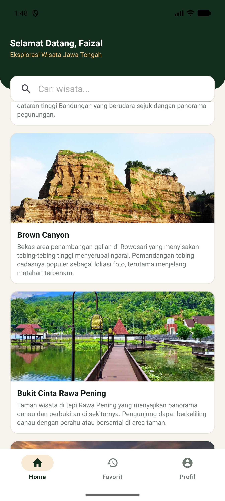 | 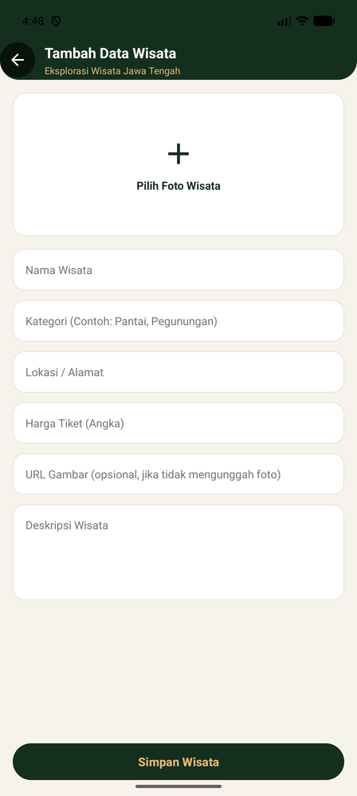 | 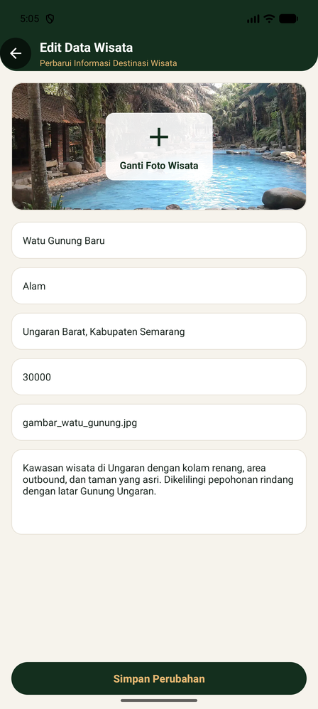 |
| Data diambil dari `wisata.php` melalui Repository lalu ditampilkan pada RecyclerView | Form Create, data dikirim ke `wisata_add.php` setelah tombol Simpan ditekan | Form Update terisi data lama, perubahannya dikirim ke `wisata_edit.php` |

| Delete – Alert Dialog Konfirmasi | Loading saat Request API | Data Kosong |
|:---:|:---:|:---:|
| 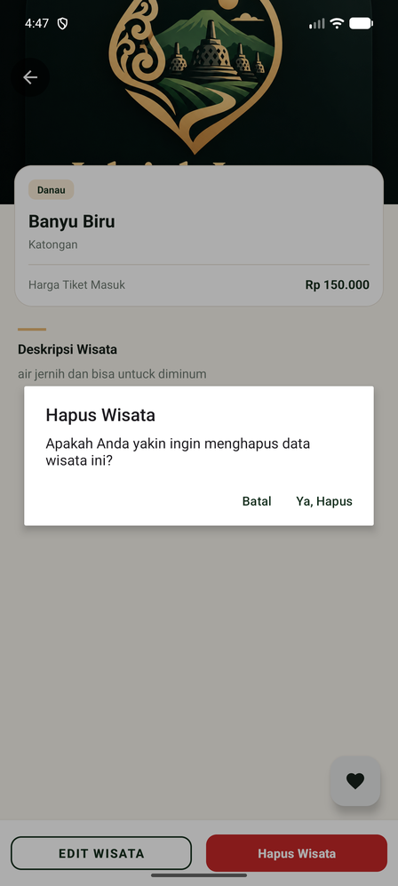 | 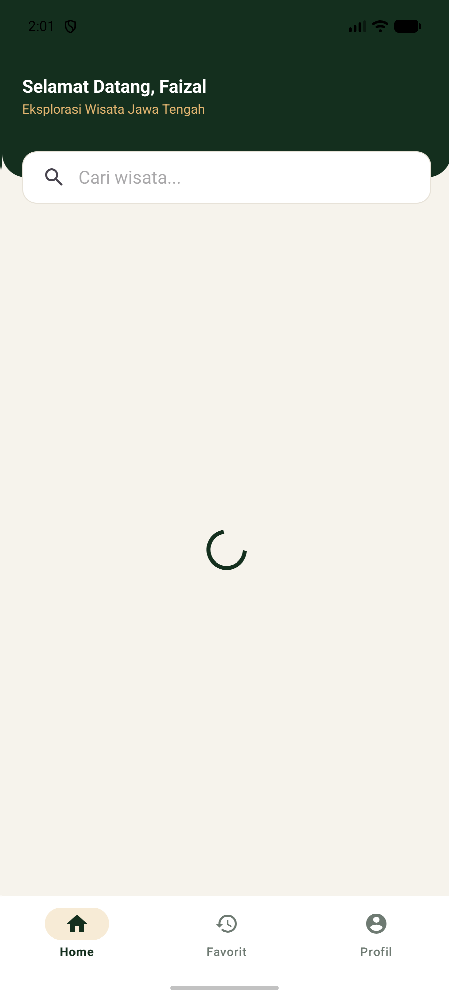 | 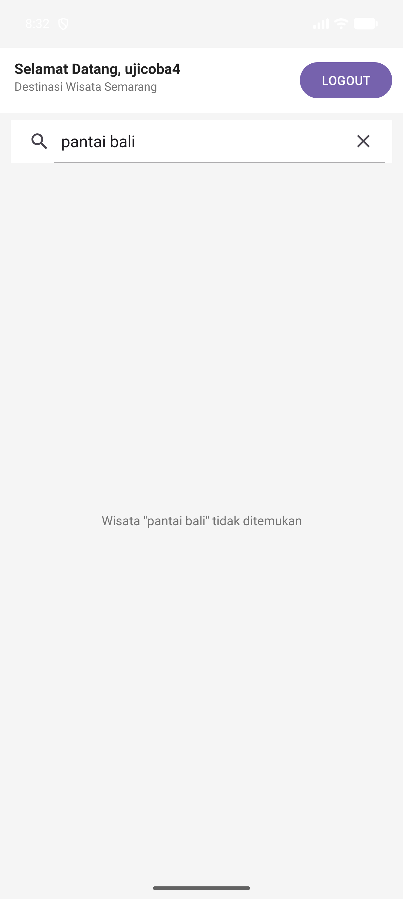 |
| Tombol **Hapus Wisata** memunculkan Alert Dialog lebih dulu: **Ya, Hapus** meneruskan ke API, **Batal** membatalkan | `ProgressBar` tampil selama aplikasi menunggu jawaban API | Keterangan muncul ketika API tidak mengembalikan data wisata |

## Catatan

- Pemeriksaan form kosong kini hanya berada di ViewModel. Sebelumnya pemeriksaan yang sama juga ditulis di Activity, sehingga ada dua tempat yang mengerjakan hal serupa.
- Pesan gagal CRUD dikumpulkan di `PesanGagal` supaya Tambah, Edit, dan Hapus memakai gaya kalimat yang sama, dan pengguna tidak lagi melihat pesan teknis seperti `java.net.ConnectException`.
- Alert Dialog hapus memakai tombol **Ya, Hapus** dan **Batal**. Memilih **Batal** tidak mengirim apa pun ke API, jadi data tetap utuh.
- Setelah Create, Update, atau Delete berhasil, Home Fragment memuat ulang daftar dari halaman pertama lewat `refreshData()` sehingga daftar selalu sama dengan isi database.
- Unggah foto sebelumnya selalu gagal dengan pesan "Foto yang dipilih tidak dapat dibaca". Penyebabnya pada `FotoHelper`: ketika `inJustDecodeBounds` bernilai `true`, `BitmapFactory.decodeStream()` memang selalu mengembalikan `null` dan hanya mengisi `outWidth` serta `outHeight`, tetapi nilai `null` itu ikut diperiksa sehingga proses berhenti sebelum gambar sempat dibaca. Sekarang keberhasilannya diperiksa dari ukuran gambar, bukan dari nilai kembalian `decodeStream()`.

---

# Branch `Tugas 7 – Implementasi Backend API CRUD & Layouting`

## Deskripsi

Melanjutkan pengembangan **TravelDestinationApp** dengan mengimplementasikan fitur **CRUD (Create, Read, Update, Delete)** data wisata menggunakan **Backend API** serta melakukan **layouting** pada halaman-halaman yang digunakan untuk fitur CRUD.

Pada tugas ini, pengguna dapat mengelola data wisata secara langsung dari aplikasi Android melalui Backend API PHP dan database MySQL:
- **Create**: Menambahkan data wisata baru melalui halaman **Tambah Data Wisata** (`AddWisataActivity`) dengan menekan **Floating Action Button (FAB)** pada Home Fragment. Data dikirim ke API `wisata_add.php` dan disimpan ke database.
- **Read**: Mengambil dan menampilkan daftar data wisata dari API `wisata.php` pada Home Fragment dan detail wisata lengkap pada halaman **Detail Wisata** (`DetailWisataActivity`).
- **Update**: Mengubah data wisata yang sudah ada melalui halaman **Edit Data Wisata** (`EditWisataActivity`). Form terisi otomatis dengan data lama, lalu dikirim ke API `wisata_edit.php` untuk diperbarui di database.
- **Delete**: Menghapus data wisata melalui Backend API `wisata_delete.php` dengan menekan tombol **Hapus Wisata** pada halaman Detail Wisata setelah memberikan konfirmasi dialog. Data yang dihapus otomatis dihilangkan dari database dan tidak lagi ditampilkan di daftar.

Foto wisata dapat diambil langsung dari galeri perangkat. Area foto pada halaman Tambah dan Edit dapat ditekan untuk membuka pemilih gambar bawaan Android, lalu gambarnya diperkecil lebih dulu sebelum dikirim ke server sebagai `multipart/form-data`. Kolom URL gambar tetap disediakan sebagai pilihan lain apabila fotonya sudah tersedia di internet.

Selain mengimplementasikan API CRUD, tugas ini juga mencakup layouting setiap halaman agar tampilan menjadi rapi, responsif, sederhana, dan mudah digunakan dengan warna tema konsisten.

## Ketentuan Fitur

- Mengembangkan Home Fragment untuk menampilkan daftar data wisata dari Backend API.
- Menambahkan Floating Action Button (FAB) pada Home Fragment untuk membuka halaman Tambah Data Wisata.
- Membuat halaman Tambah Data Wisata (`AddWisataActivity`) yang berisi form untuk memasukkan data wisata baru (`nama_wisata`, `kategori`, `lokasi`, `harga_tiket`, `foto`, `deskripsi`).
- Mengirimkan data baru ke Backend API (`wisata_add.php`) dan memperbarui daftar wisata pada Home Fragment.
- Menyediakan pemilihan foto wisata dari galeri perangkat pada halaman Tambah dan Edit, lalu mengunggahnya ke folder `login_api/uploads/`.
- Membuat halaman Detail Wisata (`DetailWisataActivity`) dengan tombol **EDIT WISATA** dan **Hapus Wisata**.
- Membuat fitur Edit Data Wisata (`EditWisataActivity`) dengan form pre-filled, lalu mengirimkan data yang diperbarui ke Backend API (`wisata_edit.php`).
- Membuat fitur Hapus Data Wisata melalui Backend API (`wisata_delete.php`) sehingga data terhapus dari database dan tidak lagi ditampilkan.
- Menampilkan indikator loading saat aplikasi melakukan request ke Backend API.
- Menangani kondisi error apabila proses pengambilan, penambahan, perubahan, atau penghapusan data mengalami masalah.
- Menangani kondisi ketika data wisata kosong.
- Menangani kondisi **Form Kosong** (memberikan peringatan apabila terdapat field data wajib yang belum diisi).
- Membuat layout setiap halaman dengan tampilan rapi, responsif, sederhana, dan mudah digunakan.

## Alur Keseluruhan Fitur CRUD

```
                        Home Fragment
                             |
                  Menampilkan Daftar Wisata
                             |
                  +----------+----------+
                  |                     |
             Klik FAB               Pilih Wisata
                  |                     |
         Form Tambah Wisata       Detail Wisata
                  |                     |
               Create               Edit / Hapus
                  |                     |
            Backend API            Backend API
                  |                     |
             Database MySQL         Database MySQL
                  |                     |
         +--------+---------------------+
         |
Daftar Wisata Diperbarui
```

## Backend API CRUD (PHP)

Backend API digunakan sebagai penghubung antara aplikasi Android dan database MySQL:

| Endpoint | Method | Parameter | Fungsi |
|---|---|---|---|
| `wisata.php` | GET | `page`, `q` | Mengambil daftar wisata (Read) dengan pagination dan pencarian |
| `wisata_detail.php` | GET | `id` | Mengambil detail lengkap satu wisata (Read) |
| `wisata_add.php` | POST | `nama_wisata`, `kategori`, `lokasi`, `harga_tiket`, `deskripsi`, `foto`, `foto_file` | Menambahkan data wisata baru ke database (Create) |
| `wisata_edit.php` | POST | `id`, `nama_wisata`, `kategori`, `lokasi`, `harga_tiket`, `deskripsi`, `foto`, `foto_file` | Mengubah data wisata yang sudah ada (Update) |
| `wisata_delete.php` | POST | `id` | Menghapus data wisata dari database (Delete) |

Kolom `foto` pada MySQL hanya menyimpan **nama file**, sedangkan gambarnya berupa file di folder `login_api/uploads/`. Karena itu `wisata_add.php` dan `wisata_edit.php` menerima dua bentuk masukan: `foto` berupa teks (URL atau nama file) dan `foto_file` berupa file sungguhan yang dikirim sebagai `multipart/form-data`. Apabila `foto_file` terisi, file disimpan ke folder `uploads/` dan namanya yang dicatat ke database.

## Alur Unggah Foto Wisata

```
Pengguna menekan area foto pada form
        |
        v
Pemilih gambar bawaan Android terbuka
        |
        v
Foto dipilih  ->  langsung tampil sebagai pratinjau
        |
        v
Foto diperkecil menjadi JPEG maksimal 1280 piksel
        |
        v
Dikirim ke API sebagai multipart "foto_file"
        |
        v
PHP menyimpan file gambar ke folder uploads/
        |
        v
MySQL mencatat nama filenya pada kolom foto
        |
        v
API mengembalikan foto_url untuk ditampilkan Glide
```

## File Baru pada Tugas Ini

| Berkas | Kegunaan |
|---|---|
| `login_api/wisata_add.php` | Endpoint API PHP untuk menambah data wisata ke database sekaligus menerima unggahan file foto |
| `login_api/wisata_edit.php` | Endpoint API PHP untuk memperbarui data wisata di database sekaligus mengganti file fotonya |
| `login_api/wisata_delete.php` | Endpoint API PHP untuk menghapus data wisata dari database beserta file fotonya |
| `ui/activity/AddWisataActivity.kt` | Activity form tambah data wisata baru beserta pemilihan foto dari galeri |
| `ui/activity/EditWisataActivity.kt` | Activity form edit/ubah data wisata beserta penggantian fotonya |
| `viewmodel/AddWisataViewModel.kt` | ViewModel untuk menangani proses tambah wisata |
| `viewmodel/EditWisataViewModel.kt` | ViewModel untuk menangani proses edit wisata dan menyegarkan data favorit di Room |
| `utils/FotoHelper.kt` | Memperkecil foto pilihan pengguna lalu membungkusnya menjadi bagian `multipart` |
| `res/layout/activity_add_wisata.xml` | Layout form tambah data wisata |
| `res/layout/activity_edit_wisata.xml` | Layout form edit data wisata |
| `res/drawable/ic_add.xml` | Ikon tambah (`+`) untuk FAB pada Home Fragment |
| `res/drawable/ic_edit.xml` | Ikon edit |
| `res/drawable/ic_delete.xml` | Ikon hapus |
| `res/drawable/bg_pilih_foto.xml` | Latar bingkai area foto wisata |
| `res/drawable/bg_label_foto.xml` | Latar tanda `+` supaya tetap terbaca saat menumpuk di atas foto |

## File yang Berubah

| Berkas | Perubahan |
|---|---|
| `login_api/wisata.php` | Diubah menjadi `ORDER BY id DESC` agar wisata baru langsung tampil di urutan teratas |
| `model/Wisata.kt` | Menambahkan interface `Serializable` dan field `foto` |
| `model/WisataResponse.kt` | Menambahkan data class `WisataActionResponse` untuk response aksi CRUD |
| `network/ApiService.kt` | Menambahkan endpoint `tambahWisata`, `editWisata`, `hapusWisata`, serta versi `@Multipart` untuk mengunggah file foto |
| `network/ApiClient.kt` | Menambahkan `writeTimeout` 30 detik agar pengiriman file foto tidak terputus |
| `repository/WisataRepository.kt` | Menambahkan method panggil API untuk aksi Tambah, Edit, dan Hapus, termasuk jalur unggah foto |
| `repository/FavoriteRepository.kt` | Menambahkan `perbarui()` dan menyatukan pemetaan `Wisata` menjadi `FavoriteWisata` |
| `data/local/room/FavoriteWisataDao.kt` | Menambahkan `@Update perbarui()` agar data favorit ikut tersegarkan saat wisatanya diubah |
| `utils/Helper.kt` | Menambahkan `muatGambar()` versi `Uri` untuk pratinjau foto sebelum diunggah |
| `login_api/koneksi.php` | Menambahkan fungsi `hapus_foto()` supaya file foto yang tidak terpakai tidak menumpuk |
| `viewmodel/WisataViewModel.kt` | Menambahkan method `refreshData()` untuk memuat ulang daftar dari awal |
| `viewmodel/DetailWisataViewModel.kt` | Menambahkan method `hapusWisata(id)` dan mereset favorit Room DB jika terhapus |
| `ui/fragment/HomeFragment.kt` | Menambahkan listener FAB Tambah dan `ActivityResultLauncher` untuk refresh otomatis |
| `res/layout/fragment_home.xml` | Menambahkan `FloatingActionButton` (`fabTambah`) di pojok kanan bawah |
| `ui/activity/DetailWisataActivity.kt` | Menambahkan listener tombol Edit dan Hapus beserta dialog konfirmasi |
| `res/layout/activity_detail_wisata.xml` | Menambahkan baris tombol aksi **EDIT WISATA** dan **Hapus Wisata** di bagian bawah |
| `AndroidManifest.xml` | Mendaftarkan `AddWisataActivity` dan `EditWisataActivity` |
| `res/values/colors.xml` | Menambahkan warna tombol CRUD (`ungu_tombol`, `biru_tombol`, `merah_hapus`) dan `putih_kabut` |
| `res/values/strings.xml` | Menambahkan string pendukung halaman Tambah, Edit, dan Hapus Wisata |

## Penanganan Kondisi

| Kondisi | Yang ditampilkan aplikasi |
|---|---|
| Sedang mengirim data ke API | ProgressBar tampil dan tombol Simpan dinonaktifkan sementara |
| Form kosong | Muncul pesan singkat "Form Kosong: Harap isi semua field data wisata" dan data tidak jadi dikirim |
| Foto belum dipilih | Data tetap dapat disimpan, server memakai gambar bawaan `logo_wisata.png` |
| Foto berhasil dipilih | Foto langsung tampil sebagai pratinjau dan label berubah menjadi "Ganti Foto Wisata" |
| Foto gagal dibaca | Muncul pesan "Foto yang dipilih tidak dapat dibaca. Coba pilih foto lain." |
| Layar diputar saat mengisi form | Foto yang sudah dipilih tetap tampil karena disimpan pada `onSaveInstanceState` |
| Tambah atau Edit berhasil | Muncul pesan dari server, halaman ditutup, dan daftar pada Home dimuat ulang otomatis |
| Tambah, Edit, atau Hapus gagal | Pesan kegagalan dari server ditampilkan dan tombol aktif kembali |
| Menekan tombol Hapus Wisata | Muncul dialog konfirmasi lebih dulu, penghapusan baru berjalan setelah dibenarkan |
| Server tidak terjangkau | Muncul keterangan gagal beserta dialog **Alamat server** untuk mengganti IP |

## Teknologi

| Bagian | Yang dipakai |
|---|---|
| Bahasa | Kotlin |
| Backend | PHP + MySQL (XAMPP) |
| Jaringan | Retrofit + Gson + OkHttp Logging Interceptor |
| Unggah berkas | Retrofit `@Multipart` + OkHttp `MultipartBody` |
| Pemilih gambar | `ActivityResultContracts.PickVisualMedia` (tanpa izin penyimpanan) |
| Arsitektur | MVVM (Repository, ViewModel, LiveData) |
| Proses latar | Coroutine (`viewModelScope`, `Dispatchers.IO`) |
| Database lokal | Room 2.8.5 |
| Gambar | Glide |
| Tata letak | ConstraintLayout + Material Components |

## Cara Menjalankan

1. Nyalakan **Apache** dan **MySQL** pada XAMPP.
2. Pastikan folder `login_api` berada di dalam `htdocs`, lalu import `database.sql` dan `database_wisata.sql`.
3. Pastikan folder `login_api/uploads/` dapat ditulis oleh Apache, karena foto yang diunggah disimpan di sana.
4. Samakan alamat server pada aplikasi dengan IP laptop (`ipconfig`). Alamat dapat diubah lewat dialog **Alamat server** yang muncul ketika aplikasi gagal terhubung.
5. Jalankan aplikasi, lakukan Login, lalu tekan **Floating Action Button** pada halaman Home untuk membuka form Tambah Wisata.
6. Tekan area foto untuk memilih gambar dari galeri, lengkapi sisa form, lalu tekan **Simpan Wisata**.
7. Untuk mengubah atau menghapus, buka salah satu wisata pada Home lalu pakai tombol **EDIT WISATA** atau **Hapus Wisata**.

## Tangkapan Layar

| Form Tambah Wisata | Detail Wisata dengan Edit & Hapus | Form Edit Wisata |
|:---:|:---:|:---:|
|  | 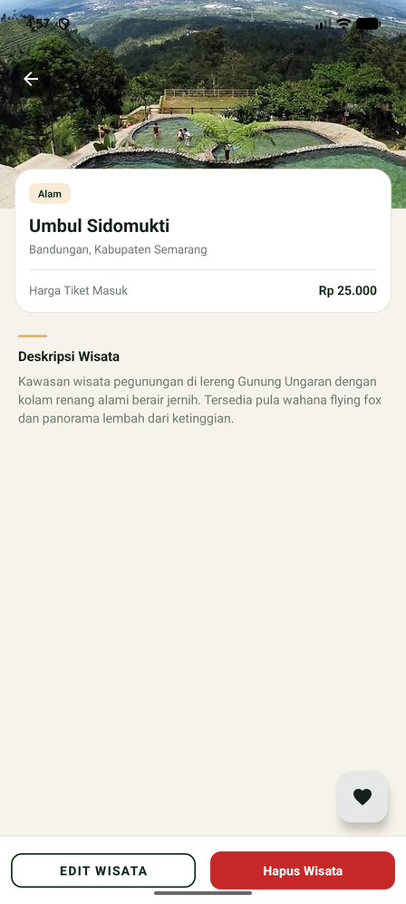 |  |
| Halaman form untuk memasukkan data wisata baru (`activity_add_wisata.xml`) | Halaman detail dilengkapi tombol **EDIT WISATA** dan **Hapus Wisata** (`activity_detail_wisata.xml`) | Form terisi otomatis dengan data lama untuk diperbarui (`activity_edit_wisata.xml`) |

| Foto Terpilih pada Form Tambah | Ganti Foto pada Form Edit |
|:---:|:---:|
| 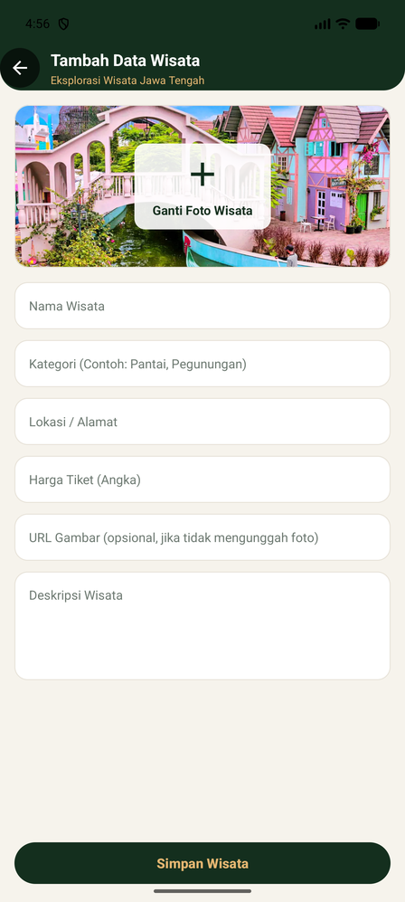 | 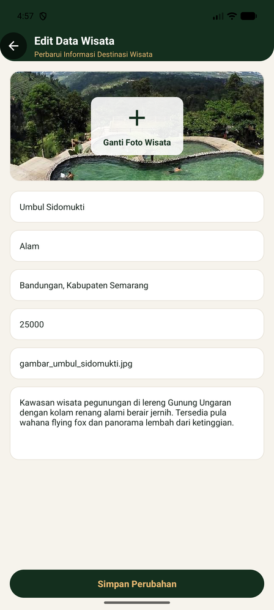 |
| Foto dari galeri langsung tampil sebagai pratinjau dan labelnya berubah menjadi **Ganti Foto Wisata** | Halaman Edit menampilkan foto lama dari server, siap diganti dengan foto baru |

## Catatan

- Pemilih gambar memakai `ActivityResultContracts.PickVisualMedia`, jadi aplikasi **tidak memerlukan izin akses penyimpanan** sama sekali.
- Foto diperkecil menjadi JPEG dengan sisi terpanjang 1280 piksel sebelum dikirim. Tanpa langkah ini, foto ponsel yang berukuran 3-8 MB akan ditolak XAMPP yang secara bawaan hanya menerima unggahan 2 MB.
- Saat wisata dihapus atau fotonya diganti, file lama di folder `uploads/` ikut dibuang. File bawaan `logo_wisata.png` dan foto yang berupa URL luar sengaja dilewati.
- Foto yang sedang dipilih ikut disimpan pada `onSaveInstanceState`, jadi tidak hilang ketika layar diputar.

---

# Branch `Tugas-6-Menambahkan-Fitur-Favorit-Wisata-dengan-Room-Database`

## Deskripsi

Melanjutkan pengembangan **TravelDestinationApp** dengan menambahkan fitur **Favorit Wisata** memakai **Room Database**.

Pada halaman Detail Wisata ditambahkan ikon love. Ketika ikon ditekan (**Like**), data wisata disimpan ke database lokal perangkat. Wisata yang sudah tersimpan langsung muncul pada Fragment Favorit. Ketika ikon ditekan lagi (**Unlike**), data dihapus dari Room Database dan otomatis hilang dari daftar favorit.

Warna ikon mengikuti isi database: **merah** berarti wisata sudah menjadi favorit, **hitam** berarti wisata belum menjadi favorit.

Karena data disimpan memakai Room, daftar favorit tidak hilang walaupun aplikasi ditutup. Ketika aplikasi dibuka kembali, Room mengambil data favorit dari perangkat lalu menampilkannya lagi pada Fragment Favorit.

Fitur ini dibuat memakai susunan **Entity → DAO → Database → Repository → ViewModel → Fragment/Activity** sesuai konsep **MVVM**, sehingga setiap bagian kode memiliki tugas yang jelas.

## Ketentuan Fitur

- Menambahkan fitur Favorit Wisata pada aplikasi TravelDestinationApp.
- Menambahkan tombol Like/Unlike berupa ikon love pada halaman Detail Wisata.
- Ketika pengguna menekan Like, data wisata disimpan ke dalam Room Database.
- Data wisata yang berhasil disimpan ditampilkan pada Fragment Favorit.
- Ketika pengguna menekan Unlike, data wisata dihapus dari Room Database.
- Setelah data dihapus, wisata otomatis hilang dari Fragment Favorit.
- Status tombol mengikuti isi database: sudah favorit berwarna merah, belum favorit berwarna hitam.
- Room Database dibuat memakai Entity, DAO, Database, Repository, dan ViewModel.
- Daftar wisata favorit ditampilkan memakai RecyclerView.
- Data favorit tetap tersimpan walaupun aplikasi ditutup dan dibuka kembali.
- Menerapkan konsep MVVM agar pembagian tugas setiap bagian kode jelas.
- Tampilan Fragment Favorit dibuat sederhana dan mudah digunakan.
- Ketika belum ada wisata favorit, halaman menampilkan keterangan bahwa daftar favorit masih kosong.

## Struktur Room Database

| Bagian | Berkas | Tugasnya |
|---|---|---|
| Entity | `data/local/room/FavoriteWisata.kt` | Menentukan bentuk data wisata yang disimpan di database |
| DAO | `data/local/room/FavoriteWisataDao.kt` | Perintah simpan, hapus, ambil, dan cek data favorit |
| Database | `data/local/room/WisataDatabase.kt` | Membuat dan mengatur Room Database |
| Repository | `repository/FavoriteRepository.kt` | Penghubung antara ViewModel dengan DAO |
| ViewModel | `viewmodel/FavoriteViewModel.kt`, `viewmodel/DetailWisataViewModel.kt` | Menyediakan data favorit untuk tampilan |
| Fragment / Activity | `ui/fragment/FavoriteFragment.kt`, `ui/activity/DetailWisataActivity.kt` | Menampilkan data kepada pengguna |

### Entity

Satu baris tabel `favorite_wisata` berisi data wisata yang disalin dari API. Isinya disimpan lengkap supaya daftar favorit tetap dapat ditampilkan walaupun aplikasi sedang tidak terhubung ke server.

```kotlin
@Entity(tableName = "favorite_wisata")
data class FavoriteWisata(
    @PrimaryKey val id: Int,
    val namaWisata: String,
    val kategori: String,
    val lokasi: String,
    val hargaTiket: Int,
    val deskripsi: String,
    val fotoUrl: String
)
```

`id` dipakai sebagai Primary Key, jadi satu wisata hanya dapat tersimpan satu kali.

### DAO

```kotlin
@Dao
interface FavoriteWisataDao {

    @Query("SELECT * FROM favorite_wisata ORDER BY namaWisata ASC")
    fun ambilSemua(): LiveData<List<FavoriteWisata>>

    @Query("SELECT EXISTS(SELECT 1 FROM favorite_wisata WHERE id = :id)")
    fun cekFavorit(id: Int): LiveData<Boolean>

    @Insert(onConflict = OnConflictStrategy.REPLACE)
    suspend fun simpan(wisata: FavoriteWisata)

    @Query("DELETE FROM favorite_wisata WHERE id = :id")
    suspend fun hapus(id: Int)
}
```

- `ambilSemua()` dipakai Fragment Favorit. Hasilnya berupa **LiveData**, jadi daftar ikut berubah sendiri setiap ada data yang ditambah atau dihapus.
- `cekFavorit()` dipakai halaman Detail untuk menentukan warna ikon love.
- `simpan()` dan `hapus()` ditandai `suspend` supaya dijalankan di luar Main Thread.

### Database

```kotlin
@Database(entities = [FavoriteWisata::class], version = 1, exportSchema = false)
abstract class WisataDatabase : RoomDatabase() {

    abstract fun favoriteWisataDao(): FavoriteWisataDao

    companion object {
        fun ambilData(context: Context): WisataDatabase { ... }
    }
}
```

Database dibuat satu kali saja lalu dipakai bersama oleh seluruh halaman, sehingga tidak ada dua database yang terbuka bersamaan. Berkasnya tersimpan di perangkat dengan nama `wisata.db`.

### Repository

`FavoriteRepository` menjadi satu-satunya bagian yang berhubungan langsung dengan DAO. Di sinilah data `Wisata` dari API disalin menjadi `FavoriteWisata` sebelum disimpan ke Room.

### ViewModel

- `FavoriteViewModel` menyediakan `daftarFavorit` untuk Fragment Favorit.
- `DetailWisataViewModel` menyediakan isi halaman detail, status favorit, dan perintah `ubahFavorit()` untuk tombol Like/Unlike.

## Alur Fitur Favorit

```
Pengguna membuka Detail Wisata
        |
        v
Room mengecek status favorit wisata tersebut
        |
        v
Belum favorit  ->  ikon love berwarna hitam
        |
        v
Pengguna menekan ikon love (Like)
        |
        v
Data disimpan ke Room Database
        |
        v
Ikon berubah menjadi merah & wisata muncul di Fragment Favorit
```

Ketika wisata sudah menjadi favorit:

```
Pengguna menekan ikon love (Unlike)
        |
        v
Data dihapus dari Room Database
        |
        v
Ikon kembali berwarna hitam & wisata hilang dari Fragment Favorit
```

Ketika aplikasi ditutup lalu dibuka kembali:

```
Aplikasi dibuka kembali  ->  Room membaca tabel favorite_wisata  ->  daftar favorit tetap tampil
```

Daftar favorit dan ikon love tidak perlu dimuat ulang secara manual karena keduanya memakai **LiveData**, jadi tampilan otomatis menyesuaikan isi database.

## Penataan Ulang Struktur Folder (MVVM)

Sebelumnya seluruh berkas Kotlin berada pada satu folder. Pada tugas ini berkas dikelompokkan sesuai tugasnya masing-masing:

```
com.example.tugas2_loginregister
├── data
│   └── local
│       └── room
│           ├── FavoriteWisata.kt        (Entity)
│           ├── FavoriteWisataDao.kt     (DAO)
│           └── WisataDatabase.kt        (Database)
├── model
│   ├── Wisata.kt
│   └── WisataResponse.kt
├── network
│   ├── ApiClient.kt
│   ├── ApiService.kt
│   ├── AuthRequest.kt
│   └── AuthResponse.kt
├── repository
│   ├── AuthRepository.kt
│   ├── FavoriteRepository.kt
│   └── WisataRepository.kt
├── ui
│   ├── activity
│   │   ├── DetailWisataActivity.kt
│   │   ├── LoginActivity.kt
│   │   ├── MainActivity.kt
│   │   ├── RegisterActivity.kt
│   │   └── SplashActivity.kt
│   ├── adapter
│   │   ├── FavoriteWisataAdapter.kt
│   │   └── WisataAdapter.kt
│   └── fragment
│       ├── FavoriteFragment.kt
│       ├── HomeFragment.kt
│       └── ProfileFragment.kt
├── utils
│   ├── DialogServer.kt
│   ├── Helper.kt
│   ├── SessionManager.kt
│   └── UiState.kt
└── viewmodel
    ├── AuthViewModel.kt
    ├── AuthViewModelFactory.kt
    ├── DetailWisataViewModel.kt
    ├── FavoriteViewModel.kt
    └── WisataViewModel.kt
```

Pengambilan data dari API juga dipindahkan ke **Retrofit** supaya alurnya mengikuti MVVM:

```
Activity / Fragment  ->  ViewModel  ->  Repository  ->  ApiService (Retrofit) / DAO (Room)
```

Activity dan Fragment sekarang hanya mengurus tampilan. Proses pengambilan data dijalankan ViewModel memakai Coroutine, lalu hasilnya dikabarkan memakai `UiState` yang berisi tiga keadaan: `Loading`, `Berhasil`, dan `Gagal`.

## File Baru pada Tugas Ini

| Berkas | Kegunaan |
|---|---|
| `data/local/room/FavoriteWisata.kt` | Entity tabel favorit |
| `data/local/room/FavoriteWisataDao.kt` | Perintah database untuk data favorit |
| `data/local/room/WisataDatabase.kt` | Pengaturan Room Database |
| `model/WisataResponse.kt` | Bentuk balasan API daftar wisata & detail wisata |
| `network/ApiService.kt` | Daftar alamat API yang dipanggil Retrofit |
| `network/AuthRequest.kt` | Data yang dikirim saat Login & Register |
| `network/AuthResponse.kt` | Balasan API Login & Register |
| `repository/AuthRepository.kt` | Penghubung ViewModel dengan API Login & Register |
| `repository/WisataRepository.kt` | Penghubung ViewModel dengan API wisata |
| `repository/FavoriteRepository.kt` | Penghubung ViewModel dengan DAO |
| `utils/UiState.kt` | Keadaan tampilan: Loading, Berhasil, Gagal |
| `viewmodel/AuthViewModel.kt` | Proses Login & Register |
| `viewmodel/AuthViewModelFactory.kt` | Pembuat `AuthViewModel` beserta Repository-nya |
| `viewmodel/WisataViewModel.kt` | Daftar wisata, pencarian, dan pagination |
| `viewmodel/DetailWisataViewModel.kt` | Isi halaman detail dan tombol Like/Unlike |
| `viewmodel/FavoriteViewModel.kt` | Daftar wisata favorit |
| `ui/adapter/FavoriteWisataAdapter.kt` | Menampilkan daftar favorit pada RecyclerView |
| `res/drawable/ic_favorite_black.xml` | Ikon love hitam (belum favorit) |
| `res/drawable/ic_favorite_red.xml` | Ikon love merah (sudah favorit) |
| `res/layout/item_loading.xml` | Baris penanda data berikutnya sedang dimuat |

## File yang Berubah

| Berkas | Perubahan |
|---|---|
| `res/layout/activity_detail_wisata.xml` | Nama berkas sebelumnya `activity_detail.xml`, ditambah ikon love di pojok kanan bawah |
| `res/layout/fragment_favorite.xml` | Dari halaman kosong menjadi RecyclerView daftar favorit beserta keterangan ketika masih kosong |
| `res/layout/fragment_home.xml` | Baris "sedang memuat" dipindahkan ke `item_loading.xml` |
| `res/menu/bottom_nav_menu.xml` | Nama berkas sebelumnya `menu_bottom.xml` |
| `res/drawable/ic_history.xml`, `res/drawable/ic_account.xml` | Nama berkas sebelumnya `ic_favorit.xml` dan `ic_profil.xml` |
| `utils/SessionManager.kt` | Nama berkas sebelumnya `Sesi.kt` |
| `network/ApiClient.kt` | Dari HttpURLConnection menjadi Retrofit, alamat server tetap dapat diubah pengguna |
| `utils/Helper.kt` | Bagian pengambilan data API dipindahkan ke Repository |
| `ui/activity/*`, `ui/fragment/*` | Pengambilan data dipindahkan ke ViewModel |
| `gradle/libs.versions.toml`, `app/build.gradle.kts` | Menambah Room, Retrofit, Lifecycle, Coroutine, dan plugin KSP |

## Penanganan Kondisi

| Kondisi | Yang ditampilkan aplikasi |
|---|---|
| Wisata belum favorit | Ikon love berwarna hitam |
| Wisata sudah favorit | Ikon love berwarna merah |
| Favorit berhasil disimpan | Muncul pesan singkat "Ditambahkan ke favorit" dan wisata masuk ke Fragment Favorit |
| Favorit dihapus | Muncul pesan singkat "Dihapus dari favorit" dan wisata hilang dari Fragment Favorit |
| Favorit kosong | Fragment Favorit menampilkan keterangan "Belum ada wisata favorit" |
| Aplikasi ditutup lalu dibuka lagi | Daftar favorit tetap tampil karena tersimpan di Room Database |
| Detail wisata gagal dimuat | Tampil keterangan gagal, dan halaman dapat dicoba ulang dengan mengetuk keterangan tersebut |

## Teknologi

| Bagian | Yang dipakai |
|---|---|
| Bahasa | Kotlin |
| Database lokal | Room 2.8.5 (Entity, DAO, Database) |
| Pengolah anotasi | KSP |
| Arsitektur | MVVM (Repository, ViewModel, LiveData) |
| Proses latar | Coroutine (`viewModelScope`) |
| Jaringan | Retrofit + Gson + OkHttp Logging Interceptor |
| Daftar data | RecyclerView + ListAdapter (DiffUtil) |
| Gambar | Glide |

## Catatan Penyesuaian Gradle

Plugin `org.jetbrains.kotlin.android` **tidak lagi dituliskan** pada `app/build.gradle.kts` karena AGP 9 sudah membawa dukungan Kotlin secara bawaan. Kalau plugin tersebut ditulis ulang, muncul error `Cannot add extension with name 'kotlin'`.

Room memakai versi **2.8.5**. Versi 2.6.1 belum dapat dipakai bersama KSP versi baru dan membuat proses build berhenti dengan pesan `[ksp] java.lang.IllegalStateException: unexpected jvm signature V`.

## Cara Menjalankan

1. Nyalakan **Apache** dan **MySQL** pada XAMPP.
2. Pastikan folder `login_api` berada di dalam `htdocs`, lalu import `database.sql` dan `database_wisata.sql`.
3. Samakan alamat server pada aplikasi dengan IP laptop (`ipconfig`). Alamat dapat diubah lewat dialog **Alamat server** yang muncul ketika aplikasi gagal terhubung.
4. Jalankan aplikasi, lakukan Login, lalu buka salah satu wisata pada halaman Home.
5. Tekan ikon love di pojok kanan bawah halaman Detail untuk menyimpan wisata ke favorit.
6. Buka menu **Favorit** pada Bottom Navigation untuk melihat daftarnya.

## Tangkapan Layar

| Belum Favorit | Menekan Ikon Love | Sudah Favorit |
|:---:|:---:|:---:|
|  | 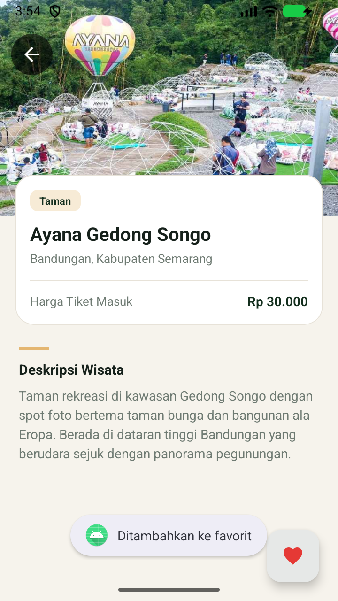 | 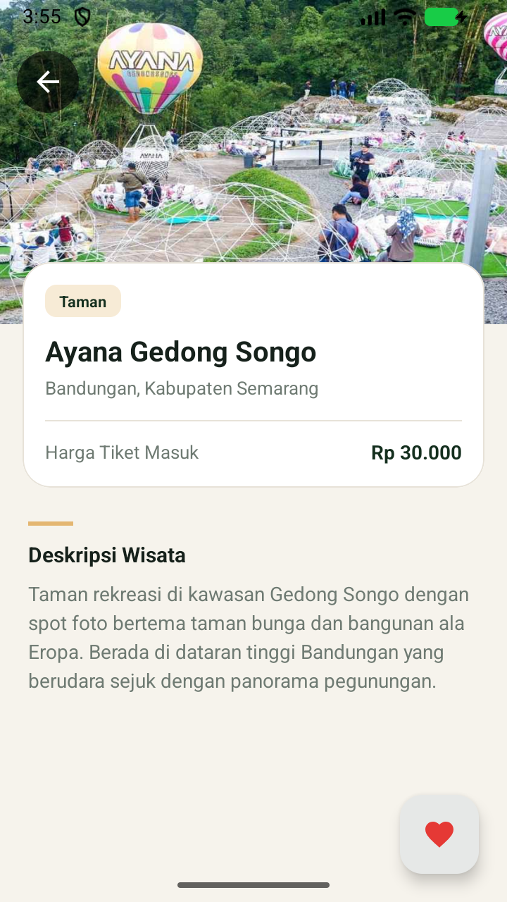 |
| Ikon love berwarna hitam karena wisata belum tersimpan di Room Database | Data disimpan ke Room Database dan muncul pesan singkat "Ditambahkan ke favorit" | Ikon berubah merah mengikuti isi database tanpa memuat ulang halaman |

| Fragment Favorit Terisi | Fragment Favorit Kosong |
|:---:|:---:|
| 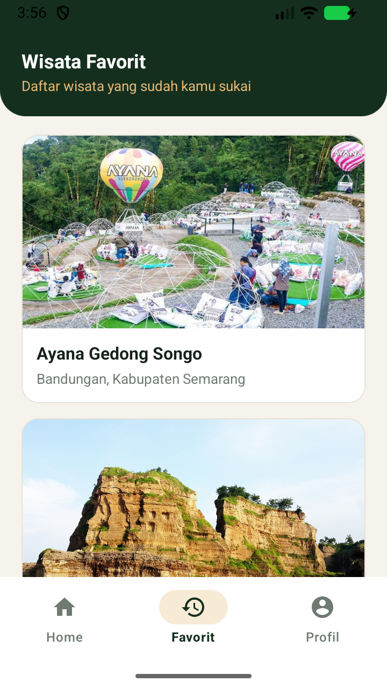 | 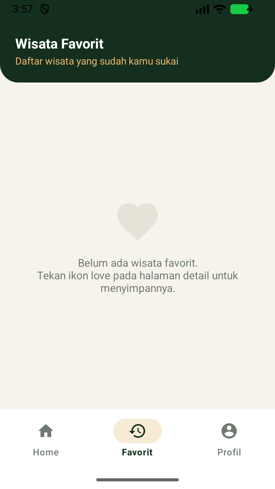 |
| Daftar wisata favorit diambil dari Room Database memakai RecyclerView | Setelah seluruh wisata di-Unlike, daftar menjadi kosong dan keterangannya langsung muncul |

## Catatan

- Data favorit disimpan di perangkat, jadi setiap perangkat memiliki daftar favoritnya sendiri dan tidak dikirim ke server.
- Wisata yang sama tidak dapat tersimpan dua kali karena `id` dipakai sebagai Primary Key.
- Ikon love dan daftar favorit memakai LiveData, jadi keduanya selalu mengikuti isi database tanpa perlu dimuat ulang.

---

# Branch `Tugas-5-Implementasi-Bottom-Navigation-Fragment-Splash-Screen-Logout`

## Deskripsi

Melanjutkan project **TravelDestinationApp** dengan menambahkan fitur **Bottom Navigation**, **Fragment**, **Splash Screen**, **Session Login**, dan **Logout**.

Pada tugas ini aplikasi dikembangkan agar memiliki navigasi yang lebih terstruktur sehingga pengguna dapat berpindah antar halaman dengan mudah melalui menu navigasi yang berada di bagian bawah aplikasi.

Aplikasi menggunakan beberapa Fragment, yaitu **Home**, **Favorit**, dan **Profil**. Setiap Fragment memiliki fungsi masing-masing dan dapat diakses melalui Bottom Navigation.

Selain itu ditambahkan **Splash Screen** yang digunakan ketika aplikasi pertama kali dibuka. Pada saat Splash Screen berjalan, aplikasi melakukan pengecekan terhadap status login pengguna. Jika pengguna sudah pernah login dan session masih tersimpan, pengguna langsung diarahkan ke halaman utama. Sebaliknya, jika pengguna belum login atau session sudah tidak tersedia, pengguna diarahkan ke halaman Login.

Untuk menyimpan status login pengguna, aplikasi menggunakan **Session Login**. Session ini digunakan agar aplikasi dapat mengingat apakah pengguna sudah login atau belum, sehingga pengguna tidak perlu melakukan login kembali setiap kali membuka aplikasi selama session masih tersedia.

Pada halaman Profil ditambahkan fitur **Logout**. Ketika pengguna menekan tombol Logout, session login dihapus dan pengguna diarahkan kembali ke halaman Login.

Dalam implementasinya, kode dibuat sederhana, rapi, dan terstruktur agar lebih mudah dipahami serta tidak terlalu banyak menggunakan kode yang rumit.

## Identitas Visual

Aplikasi diberi identitas **Jelajah Jateng** memakai logo bertema Jawa Tengah, berupa siluet candi dan pegunungan di dalam pin lokasi yang dipadukan dengan ukiran berwarna emas.

Berkas logo aslinya berada di `login_api/uploads/logo_wisata.png` berukuran 1254 x 1254 piksel. Sebelum dipakai, logo dirapikan lebih dulu: margin hitam beserta bayangannya dipotong, gambar disamakan menjadi bujur sangkar, sudutnya dibulatkan dan dibuat transparan, lalu diperkecil menjadi 512 x 512 piksel. Hasilnya disimpan sebagai `res/drawable/logo_jelajah.png` dan dipakai pada Splash Screen, halaman Login, serta halaman Register.

Warna aplikasi diambil langsung dari logo tersebut, bukan dipilih terpisah, supaya seluruh tampilan terasa menyatu:

| Nama warna | Kode | Diambil dari | Dipakai untuk |
|---|---|---|---|
| `hijau_malam` | `#050F0E` | latar kotak logo | latar Splash Screen |
| `hijau_hutan` | `#142F1E` | bagian tergelap pada logo | warna utama: header, tombol, menu aktif |
| `hijau_daun` | `#46693F` | gunung dan sawah pada logo | hijau pendukung |
| `emas` | `#E4B671` | tulisan dan ukiran pada logo | warna aksen |
| `emas_muda` | `#F7EBD6` | turunan warna emas | label kategori dan indikator menu |
| `krem` | `#F6F3EC` | netral hangat penyeimbang | latar halaman |

Seluruh warna dikumpulkan di `res/values/colors.xml`, lalu dipasangkan ke warna bawaan Material 3 pada `res/values/themes.xml`:

```xml
<item name="colorPrimary">@color/hijau_hutan</item>
<item name="colorOnPrimary">@color/emas</item>
<item name="colorSecondary">@color/emas</item>
<item name="colorSecondaryContainer">@color/emas_muda</item>
```

Karena diatur lewat tema, tombol, indikator Bottom Navigation, dan warna ikon ikut menyesuaikan sendiri tanpa perlu diatur satu per satu di setiap layout. Kode warna yang sebelumnya ditulis langsung di file layout diganti menjadi rujukan `@color/...`, sehingga mengubah warna aplikasi cukup dilakukan pada satu berkas saja.

Halaman Home memakai header hijau bersudut bawah membulat dengan kolom pencarian yang sengaja diletakkan menumpuk pada tepi bawah header. Halaman Detail mendapat tombol kembali berbentuk bulat di atas foto serta garis aksen emas sebagai penanda judul deskripsi.

## Perbaikan Force Close

Pada pengujian ditemukan aplikasi berhenti sendiri beberapa detik setelah Splash Screen apabila server sedang tidak dapat dihubungi:

```
java.lang.IllegalStateException: Fragment HomeFragment not attached to an activity.
    at androidx.fragment.app.Fragment.requireActivity(Fragment.java:995)
    at HomeFragment.tampilkanError(HomeFragment.kt:303)
```

Penyebabnya, `MainActivity` membuat `HomeFragment` sebanyak dua kali ketika halaman utama dibuka:

```kotlin
// Sebelum
if (savedInstanceState == null) {
    bukaHalaman(HomeFragment())                 // Fragment pertama dibuat
    bottomNav.selectedItemId = R.id.menuHome    // memicu listener, Fragment kedua dibuat
}
```

Fragment pertama langsung digantikan Fragment kedua, padahal permintaan datanya sudah berjalan. Ketika permintaan itu gagal, `tampilkanError()` memanggil `requireActivity()` pada Fragment yang sudah terlepas dari Activity, lalu aplikasi berhenti.

Perbaikannya dilakukan di dua tempat. Pertama, listener menu dipasang setelah halaman awal dibuka sehingga Fragment hanya dibuat satu kali:

```kotlin
// Sesudah
if (savedInstanceState == null) {
    bottomNav.selectedItemId = R.id.menuHome
    bukaHalaman(HomeFragment())
}

bottomNav.setOnItemSelectedListener { menu -> ... }
```

Kedua, hasil permintaan jaringan hanya diproses selama Fragment masih menempel pada Activity:

```kotlin
private fun masihAktif(token: Int): Boolean {
    return isAdded && view != null && token == tokenPermintaan
}
```

Pengecekan tersebut sekaligus melindungi kondisi lain, misalnya pengguna berpindah ke menu Favorit atau Profil sewaktu data masih dimuat.

## Ketentuan Fitur

| # | Ketentuan | Pemenuhan |
|---|---|---|
| 1 | Menambahkan Bottom Navigation sebagai navigasi utama aplikasi | `BottomNavigationView` pada `activity_main.xml` dengan menu `menu_bottom.xml` |
| 2 | Bottom Navigation dipakai berpindah antar halaman lewat menu di bagian bawah | Tiga menu: Home, Favorit, dan Profil |
| 3 | Membuat Fragment Home untuk menampilkan halaman utama aplikasi | `HomeFragment` + `fragment_home.xml`, berisi daftar wisata, pencarian, dan pagination |
| 4 | Membuat Fragment riwayat untuk halaman kedua | `FavoriteFragment` + `fragment_favorite.xml`, menampilkan teks `Ini Halaman Favorit` |
| 5 | Membuat Fragment Profil untuk informasi pengguna dan fitur Logout | `ProfileFragment` + `fragment_profile.xml`, berisi ikon profil, nama pengguna, dan tombol Logout |
| 6 | Memilih menu menampilkan Fragment yang sesuai tanpa membuka Activity baru | `supportFragmentManager.beginTransaction().replace(...)` di dalam `MainActivity` |
| 7 | Menambahkan Splash Screen saat aplikasi pertama kali dibuka | `SplashActivity` + `activity_splash.xml`, tampil selama 2 detik |
| 8 | Splash Screen melakukan pengecekan status login | `Sesi.sudahLogin()` dipanggil sebelum berpindah halaman |
| 9 | Sudah login dan session tersedia diarahkan ke halaman utama | Splash membuka `MainActivity` |
| 10 | Belum login atau session tidak tersedia diarahkan ke halaman Login | Splash membuka `LoginActivity` |
| 11 | Menambahkan Session Login untuk menyimpan status login | `Sesi.kt` menyimpan `sudah_login` dan `username` di `SharedPreferences` |
| 12 | Menambahkan fitur Logout pada halaman Profil | Tombol Logout memanggil `Sesi.keluar()` |
| 13 | Logout menghapus session dan status login menjadi tidak aktif | `Sesi.hapus()` mengosongkan seluruh isi `SharedPreferences` |
| 14 | Logout mengarahkan pengguna kembali ke halaman Login | `Intent` ke `LoginActivity` |
| 15 | Setelah Logout, tombol Back tidak dapat kembali ke halaman utama | `FLAG_ACTIVITY_NEW_TASK` + `FLAG_ACTIVITY_CLEAR_TASK` menghapus tumpukan halaman |
| 16 | Tampilan halaman dan navigasi responsif, sederhana, dan mudah digunakan | `ConstraintLayout` + `FragmentContainerView`, Bottom Navigation bawaan Material 3 |
| 17 | Kode rapi dan terstruktur, setiap bagian memiliki fungsi yang jelas | Setiap halaman dipisah ke Fragment sendiri, urusan session dikumpulkan di `Sesi.kt` |

## Alur Aplikasi

```
Aplikasi Dibuka
       |
  Splash Screen
       |
  Cek Session Login
       |
       +-- sudah login  -->  Home
       |
       +-- belum login  -->  Login
```

Setelah pengguna berhasil login, pengguna dapat memakai Bottom Navigation untuk berpindah halaman:

```
Home  <->  Favorit  <->  Profil
```

Jika pengguna berada di Profil dan memilih Logout:

```
Logout
   |
Hapus Session
   |
Kembali ke Login
```

## Penanganan Kondisi

| Kondisi | Yang terjadi |
|---|---|
| **Sudah Login** | Session masih tersedia, pengguna tidak perlu login kembali dan langsung masuk ke halaman utama |
| **Belum Login** | Session tidak ditemukan, pengguna diarahkan ke halaman Login |
| **Logout** | Session pengguna dihapus dan aplikasi kembali ke halaman Login |
| **Navigasi Fragment** | Pengguna berpindah antara Home, Favorit, dan Profil memakai Bottom Navigation |

## Tujuan

Menerapkan konsep navigasi dan session login pada aplikasi Android melalui penggunaan Bottom Navigation, Fragment, Splash Screen, dan Logout.

Dengan adanya Bottom Navigation, pengguna dapat berpindah antar halaman dengan lebih mudah. Penggunaan Fragment juga membuat struktur halaman aplikasi menjadi lebih terorganisir karena setiap halaman memiliki Fragment masing-masing.

Splash Screen digunakan untuk melakukan pengecekan status login sebelum menentukan halaman yang akan ditampilkan kepada pengguna. Sedangkan Session Login digunakan agar aplikasi dapat menyimpan status pengguna sehingga pengguna tidak harus melakukan login berulang kali.

Fitur Logout digunakan untuk memberikan kontrol kepada pengguna ketika ingin keluar dari akun. Setelah Logout dilakukan, session dihapus dan pengguna dikembalikan ke halaman Login.

Dengan implementasi fitur tersebut, TravelDestinationApp memiliki navigasi yang lebih baik, alur login yang lebih jelas, serta struktur kode yang sederhana, rapi, terstruktur, dan mudah dipahami.

## File Baru pada Tugas Ini

| File | Kegunaan |
|---|---|
| `SplashActivity.kt` | Halaman pembuka sekaligus pengecekan status login |
| `activity_splash.xml` | Tampilan Splash Screen |
| `Sesi.kt` | Menyimpan, membaca, dan menghapus session login |
| `HomeFragment.kt` | Halaman utama berisi daftar wisata, pencarian, dan pagination |
| `FavoriteFragment.kt` | Halaman kedua |
| `fragment_favorite.xml` | Tampilan halaman kedua |
| `ProfileFragment.kt` | Halaman profil berisi ikon profil, nama pengguna, dan tombol Logout |
| `fragment_profile.xml` | Tampilan halaman profil |
| `menu_bottom.xml` | Menu Bottom Navigation |
| `ic_home.xml`, `ic_favorit.xml`, `ic_profil.xml` | Ikon menu Bottom Navigation |
| `logo_jelajah.png` | Logo aplikasi hasil rapian, dipakai di Splash, Login, dan Register |
| `bg_header.xml` | Latar header halaman Home dengan sudut bawah membulat |
| `bg_pencarian.xml` | Latar kolom pencarian berbentuk kartu putih |
| `bg_tombol_bulat.xml` | Latar bulat tombol kembali pada halaman Detail |
| `ic_kembali.xml` | Ikon panah untuk tombol kembali |
| `warna_menu_bawah.xml` | Warna ikon dan teks Bottom Navigation saat aktif maupun tidak |

## File yang Berubah

| File | Perubahan |
|---|---|
| `activity_main.xml` | Diganti isinya menjadi `FragmentContainerView` + `BottomNavigationView` |
| `fragment_home.xml` | Nama file sebelumnya `activity_main.xml`. Tombol Logout di bagian atas dihapus karena Logout kini berada di halaman Profil |
| `MainActivity.kt` | Tidak lagi berisi logika daftar wisata, kini hanya mengatur perpindahan Fragment |
| `LoginActivity.kt` | Menyimpan session lewat `Sesi.simpan()` ketika login berhasil |
| `AndroidManifest.xml` | `SplashActivity` menjadi halaman yang dibuka pertama kali, memakai tema khusus agar ikon status bar terbaca di atas latar gelap |
| `colors.xml` | Diisi palet warna yang diambil dari logo |
| `themes.xml` | Palet dipasangkan ke warna Material 3, ditambah tema khusus Splash Screen |
| `strings.xml` | Nama aplikasi menjadi `Jelajah Jateng` |
| `activity_splash.xml` | Latar hijau gelap dengan logo di tengah, tulisan nama aplikasi dihapus karena sudah ada pada logo |
| `activity_detail.xml` | Warna disesuaikan, ditambah tombol kembali dan garis aksen emas |
| `DetailActivity.kt` | Menangani tombol kembali dan jarak tepi status bar |
| `activity_login.xml`, `activity_register.xml` | Logo dipasang di bagian atas halaman |
| `item_wisata.xml`, `fragment_profile.xml`, `fragment_favorite.xml`, `bg_kategori.xml` | Kode warna diganti menjadi rujukan `@color/...` |

## Isi `Sesi.kt`

| Fungsi | Kegunaan |
|---|---|
| `simpan()` | Menyimpan status login dan username setelah login berhasil |
| `sudahLogin()` | Mengecek apakah session masih tersedia, dipakai oleh Splash Screen |
| `ambilUsername()` | Mengambil username yang tersimpan, dipakai halaman Home |
| `hapus()` | Menghapus seluruh isi session |
| `keluar()` | Menghapus session lalu kembali ke halaman Login tanpa bisa di-Back |

Bagian yang membuat tombol Back tidak dapat kembali ke halaman utama:

```kotlin
val intent = Intent(activity, LoginActivity::class.java)
intent.flags = Intent.FLAG_ACTIVITY_NEW_TASK or Intent.FLAG_ACTIVITY_CLEAR_TASK

activity.startActivity(intent)
activity.finish()
```

`FLAG_ACTIVITY_CLEAR_TASK` menghapus seluruh halaman yang sudah terbuka sebelumnya, sehingga setelah Logout tidak ada lagi halaman utama yang tersisa di belakang halaman Login.

## Perpindahan Fragment

Perpindahan halaman cukup mengganti isi `FragmentContainerView`, tanpa membuka Activity baru:

```kotlin
bottomNav.setOnItemSelectedListener { menu ->
    bukaHalaman(
        when (menu.itemId) {
            R.id.menuFavorit -> FavoriteFragment()
            R.id.menuProfil -> ProfileFragment()
            else -> HomeFragment()
        }
    )
    true
}

private fun bukaHalaman(fragment: Fragment) {
    supportFragmentManager.beginTransaction()
        .replace(R.id.wadahFragment, fragment)
        .commit()
}
```

## Teknologi

| Bagian | Teknologi |
|---|---|
| Navigasi bawah | `BottomNavigationView` (Material 3) |
| Halaman | `Fragment` + `FragmentContainerView` |
| Perpindahan halaman | `supportFragmentManager` |
| Splash Screen | `Activity` + `Handler.postDelayed` |
| Session login | `SharedPreferences` |
| Ikon menu | Vector drawable |
| Warna dan tema | Material 3 color roles + `colors.xml` |
| Logo aplikasi | PNG dengan latar transparan |
| Jarak tepi layar | `WindowInsetsCompat` |

## Tangkapan Layar

| Splash Screen | Home Fragment |
|:---:|:---:|
| 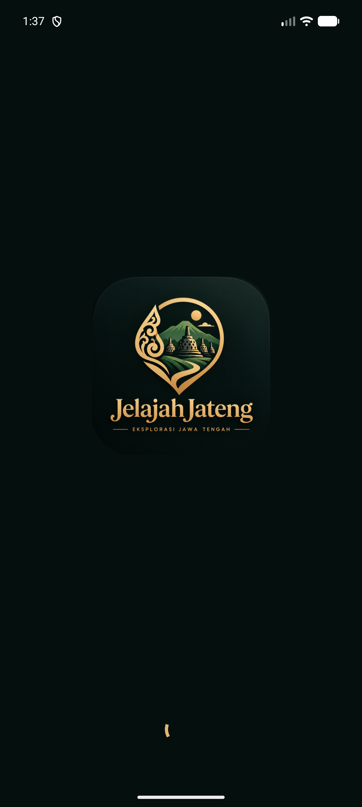 | 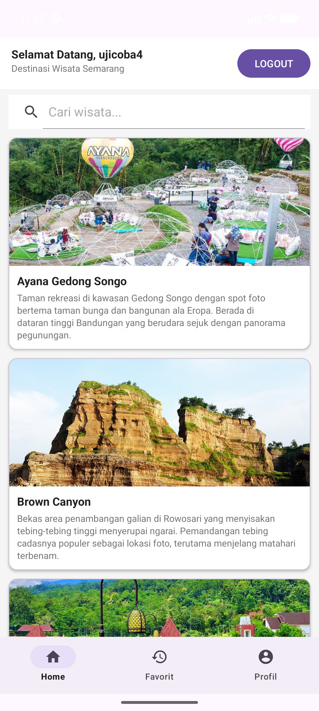 |
| Tampil saat aplikasi dibuka sambil mengecek status login | Halaman utama berisi daftar wisata, sapaan namanya diambil dari session |

| Favorit Fragment | Profil Fragment | Setelah Logout |
|:---:|:---:|:---:|
|  | 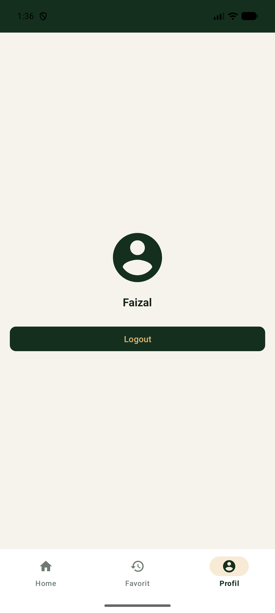 | 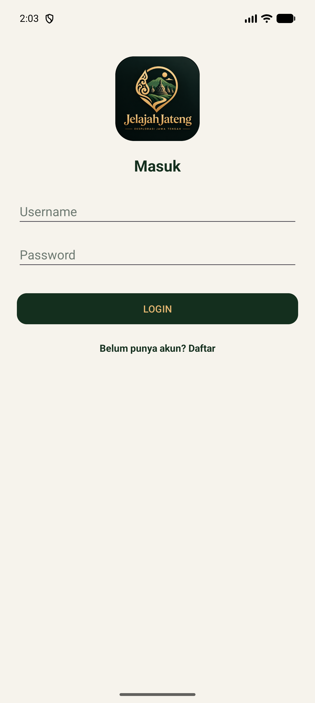 |
| Halaman kedua yang dibuka lewat Bottom Navigation | Ikon profil, nama pengguna, dan tombol Logout berwarna hijau dengan tulisan emas | Session dihapus dan aplikasi kembali ke halaman Login |

| Halaman Login | Halaman Register |
|:---:|:---:|
| 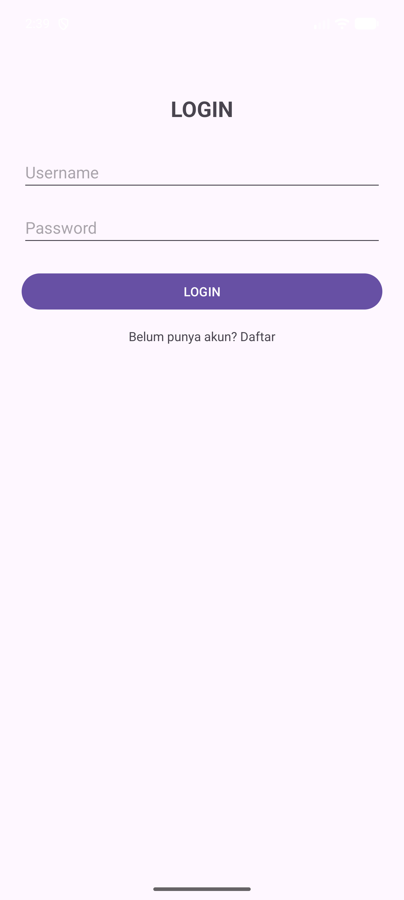 | 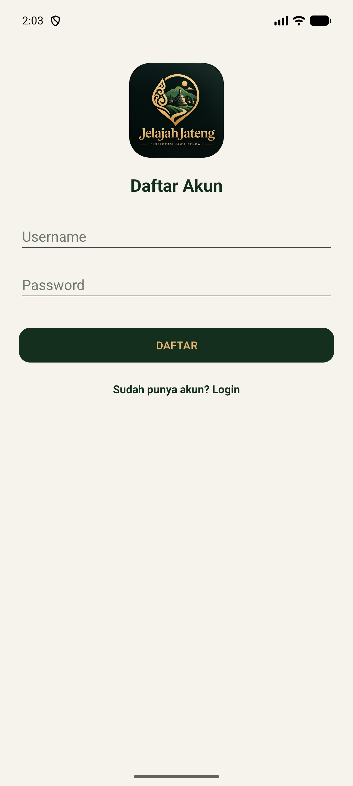 |
| Logo dipasang di bagian atas sebagai penanda identitas aplikasi | Warna tombol dan tautan mengikuti tema yang sama dengan halaman Login |

## Catatan

- Session disimpan di `SharedPreferences` dengan nama `sesi_login`, terpisah dari `pengaturan_server` yang dipakai menyimpan alamat server.
- Username tidak lagi dikirim antar halaman memakai `Intent.putExtra`. Halaman Home mengambilnya langsung dari session lewat `Sesi.ambilUsername()`.
- Tombol Logout di bagian atas halaman Home dihapus supaya tidak ada dua tombol dengan fungsi yang sama. Logout hanya tersedia di halaman Profil sesuai ketentuan tugas.
- Nama pengguna pada halaman Profil dan sapaan pada halaman Home sama-sama dibaca dari session lewat `Sesi.ambilUsername()`.
- Pada Android 12 ke atas, sistem menampilkan splash bawaan berisi ikon aplikasi sesaat sebelum `SplashActivity` muncul. Hal tersebut merupakan bawaan sistem, bukan bagian dari layout `activity_splash.xml`. Ikon peluncur aplikasi sendiri masih memakai ikon bawaan Android Studio, sehingga splash bawaan sistem belum memakai logo Jelajah Jateng.
- Mulai Android 15, warna status bar tidak lagi dapat diatur lewat `android:statusBarColor`. Karena itu jarak untuk status bar diatur dari kode memakai `WindowInsetsCompat`, sehingga bagian atas layar ikut berwarna hijau menyatu dengan header, sedangkan Bottom Navigation tetap putih sampai ke tepi bawah layar.
- Warna pada mode gelap sengaja dibuat sama dengan mode terang. Tujuannya agar tampilan tetap konsisten, sebab warna pada layout ditulis sebagai warna tetap yang diambil dari logo.

---

# Branch `Tugas-4-Implementasi-Fitur-Search-Detail`

## Deskripsi

Melanjutkan project **TravelDestinationApp** dengan menambahkan fitur **Search** dan **Detail** destinasi wisata.

Pada tugas ini aplikasi dikembangkan agar pengguna dapat mencari destinasi wisata berdasarkan kata kunci tertentu. Data hasil pencarian diambil melalui **API Search**, sehingga pengguna dapat menemukan tempat wisata yang diinginkan dengan lebih mudah dan cepat.

Selain fitur pencarian, aplikasi juga memiliki halaman **Detail Destinasi**. Ketika pengguna memilih salah satu destinasi dari daftar hasil pencarian maupun daftar destinasi, aplikasi mengambil informasi detail berdasarkan **ID destinasi** menggunakan **API Detail**.

Dalam implementasinya digunakan **`Helper.kt`** untuk membantu meringkas kode yang sering digunakan, sehingga kode program menjadi lebih sederhana, mudah dibaca, dan tidak terjadi penulisan kode yang sama secara berulang.

Aplikasi juga menangani berbagai kondisi yang mungkin terjadi selama proses pengambilan data dari API, seperti **loading**, **error**, dan **data kosong**. Dengan demikian pengguna tetap mendapatkan informasi yang jelas ketika aplikasi sedang mengambil data, terjadi kesalahan, atau tidak ditemukan data yang sesuai dengan pencarian.

## Ketentuan Fitur

| # | Ketentuan | Pemenuhan |
|---|---|---|
| 1 | Menambahkan fitur Search berdasarkan kata kunci yang dimasukkan pengguna | `SearchView` pada `activity_main.xml`, kata kunci dikirim ke API lewat parameter `q` |
| 2 | Data hasil pencarian diambil menggunakan API Search | `wisata.php?page=<n>&q=<kata kunci>` |
| 3 | Menampilkan hasil pencarian secara jelas dan mudah dipahami | Hasil tampil sebagai kartu berisi gambar, nama, dan deskripsi pada `RecyclerView` yang sama |
| 4 | Memilih salah satu destinasi membuka halaman Detail Destinasi | Kartu diketuk, `WisataAdapter` mengirim datanya ke `MainActivity`, lalu `DetailActivity` dibuka |
| 5 | Data detail diambil menggunakan API Detail berdasarkan ID | `wisata_detail.php?id=<id>`, id dikirim lewat `Intent.putExtra("id", ...)` |
| 6 | Menampilkan informasi detail destinasi | Gambar, nama wisata, kategori, lokasi, harga tiket masuk, dan deskripsi |
| 7 | Membuat file `Helper.kt` untuk meringkas kode yang sering digunakan | Berisi pemanggilan API, pembacaan JSON, atur tampil/sembunyi view, muat gambar, toast, dan format rupiah |
| 8 | Menampilkan loading indicator saat mencari atau mengambil data detail | `pbAwal` / `pbMuatLagi` di daftar wisata, `pbLoading` di halaman detail |
| 9 | Menampilkan error state apabila terjadi kesalahan saat mengambil data | Pesan gagal yang dapat diketuk untuk memuat ulang, pada daftar maupun halaman detail |
| 10 | Menampilkan empty state apabila data tidak ditemukan atau kosong | Pesan `Wisata "<kata kunci>" tidak ditemukan` dan `Belum ada data wisata` |
| 11 | Kode rapi, sederhana, dan terstruktur | Setiap pekerjaan dipisah menjadi fungsi pendek, kode yang berulang dipindah ke `Helper.kt` |
| 12 | Tampilan responsif, user-friendly, dan mudah digunakan | `ConstraintLayout` + `ScrollView`, kartu `MaterialCardView`, pencarian otomatis setelah berhenti mengetik |

## Penanganan Kondisi

Aplikasi menangani empat kondisi selama proses pengambilan data:

| Kondisi | Tampilan di Daftar Wisata | Tampilan di Halaman Detail |
|---|---|---|
| **Loading** | `ProgressBar` di tengah layar saat pemuatan pertama, `ProgressBar` di bawah daftar saat memuat halaman berikutnya | `ProgressBar` di tengah layar, isi detail disembunyikan dulu |
| **Success** | Daftar kartu destinasi wisata | Gambar, kategori, nama, lokasi, harga tiket, dan deskripsi |
| **Empty** | `Wisata "<kata kunci>" tidak ditemukan` atau `Belum ada data wisata` | `Data wisata tidak ditemukan` apabila id tidak ada di database |
| **Error** | Pesan gagal memuat yang dapat diketuk untuk mencoba lagi, serta dialog untuk memperbaiki alamat server | `Gagal memuat detail wisata. Ketuk di sini untuk mencoba lagi.` |

## Tujuan

Menerapkan fitur Search dan Detail pada aplikasi TravelDestinationApp agar pengguna dapat menemukan destinasi wisata dengan lebih mudah serta melihat informasi yang lebih lengkap mengenai destinasi yang dipilih.

Penggunaan API Search bertujuan mengambil data berdasarkan kata kunci yang dimasukkan pengguna, sedangkan API Detail berdasarkan ID digunakan untuk mendapatkan informasi lengkap dari destinasi tertentu.

Selain itu, penggunaan `Helper.kt` bertujuan membuat kode menjadi lebih sederhana, rapi, mudah dibaca, dan tidak terjadi pengulangan kode yang tidak diperlukan.

Dengan adanya fitur Search dan Detail, aplikasi menjadi lebih interaktif, ringan, mudah digunakan, dan memiliki struktur kode yang baik, sehingga pengguna dapat mencari destinasi wisata dan melihat detail informasinya dengan lebih nyaman.

## File Baru pada Tugas Ini

| File | Kegunaan |
|---|---|
| `Helper.kt` | Kumpulan kode yang sering dipakai di banyak halaman |
| `DetailActivity.kt` | Halaman detail satu destinasi wisata |
| `activity_detail.xml` | Tampilan halaman detail |
| `bg_kategori.xml` | Latar label kategori yang sudutnya membulat |
| `wisata_detail.php` | API detail wisata berdasarkan id |

## Isi `Helper.kt`

Kode yang sebelumnya ditulis berulang di banyak tempat dikumpulkan menjadi satu:

| Fungsi | Kegunaan |
|---|---|
| `ambilDataApi()` | Memanggil API di thread terpisah, hasilnya dikembalikan ke layar. `Thread` dan `try-catch` cukup ditulis satu kali |
| `bacaWisata()` | Mengubah satu data JSON menjadi objek `Wisata`, dipakai daftar wisata maupun halaman detail |
| `tampil()` / `sembunyi()` | Menampilkan atau menyembunyikan beberapa view sekaligus |
| `tampilJika()` | Menampilkan view apabila syaratnya terpenuhi |
| `muatGambar()` | Memuat gambar dari alamat URL dengan Glide |
| `pesanSingkat()` | Menampilkan `Toast` |
| `rupiah()` | Mengubah `50000` menjadi `Rp 50.000`, dan `0` menjadi `Gratis` |
| `sandikan()` | Merapikan kata kunci supaya aman dipakai di alamat API |

Contoh perbandingan sebelum dan sesudah memakai `Helper.kt`:

```kotlin
// Sebelum
Thread {
    try {
        val json = JSONObject(ApiClient.get(this, alamat))
        runOnUiThread { tampilkanData(json) }
    } catch (e: Exception) {
        runOnUiThread { tampilkanError() }
    }
}.start()

// Sesudah
Helper.ambilDataApi(
    activity = this,
    alamat = alamat,
    saatBerhasil = { json -> tampilkanData(json) },
    saatGagal = { tampilkanError() }
)
```

## Teknologi

| Bagian | Teknologi |
|---|---|
| Bahasa aplikasi | Kotlin |
| Pencarian | `SearchView` + `OnQueryTextListener` |
| Daftar data | `RecyclerView` + `LinearLayoutManager` |
| Tata letak layar | `ConstraintLayout`, `ScrollView`, `LinearLayout` |
| Tampilan kartu | `MaterialCardView` |
| Memuat gambar | Glide 4.16.0 |
| Perpindahan halaman | `Intent` + `putExtra` |
| Koneksi jaringan | `HttpURLConnection` (GET) |
| Parsing data | `org.json.JSONObject` |
| Backend | PHP 8 (`mysqli` + prepared statement) |
| Database | MySQL / MariaDB (XAMPP) |
| minSdk / targetSdk | 24 / 37 |

## Struktur File

```
TravelDestinationApp/
├── app/src/main/
│   ├── java/com/example/tugas2_loginregister/
│   │   ├── ApiClient.kt           -> penghubung ke API PHP + alamat server
│   │   ├── Helper.kt              -> kode yang sering dipakai di banyak halaman
│   │   ├── DialogServer.kt        -> dialog untuk mengganti alamat server
│   │   ├── Wisata.kt              -> data satu destinasi wisata
│   │   ├── WisataAdapter.kt       -> mengubah data menjadi kartu di layar
│   │   ├── MainActivity.kt        -> daftar wisata + pencarian + pagination
│   │   ├── DetailActivity.kt      -> halaman detail destinasi wisata
│   │   ├── LoginActivity.kt       -> halaman login
│   │   └── RegisterActivity.kt    -> halaman register
│   ├── res/layout/
│   │   ├── activity_main.xml      -> pencarian, daftar, loading, dan pesan
│   │   ├── activity_detail.xml    -> tampilan halaman detail
│   │   ├── item_wisata.xml        -> tampilan satu kartu wisata
│   │   ├── activity_login.xml     -> tampilan login
│   │   └── activity_register.xml  -> tampilan register
│   ├── res/drawable/
│   │   └── bg_kategori.xml        -> latar label kategori
│   └── AndroidManifest.xml
├── login_api/                     -> API PHP
│   ├── koneksi.php                -> koneksi ke MySQL
│   ├── login.php                  -> mengecek username & password
│   ├── register.php               -> menyimpan user baru
│   ├── wisata.php                 -> API daftar wisata (pagination + search)
│   ├── wisata_detail.php          -> API detail wisata berdasarkan id
│   ├── database.sql               -> struktur tabel users
│   ├── database_wisata.sql        -> struktur + 30 data wisata
│   └── uploads/                   -> 30 file gambar wisata
└── screenshot/                    -> tangkapan layar aplikasi
```

## Database

Database: `login_register` — tabel: `wisata`

| Kolom | Tipe | Keterangan |
|---|---|---|
| `id` | INT(11) | Primary key, auto increment |
| `nama_wisata` | VARCHAR(100) | Nama destinasi wisata |
| `kategori` | VARCHAR(50) | **Baru** — Alam, Sejarah, Budaya, Religi, Taman, Hiburan, atau Pantai |
| `lokasi` | VARCHAR(100) | **Baru** — kecamatan dan wilayah destinasi |
| `harga_tiket` | INT(11) | **Baru** — harga tiket masuk dalam rupiah, `0` berarti gratis |
| `deskripsi` | TEXT | Penjelasan singkat destinasi |
| `foto` | VARCHAR(255) | **Nama file** gambar di folder `uploads`, bukan gambarnya |
| `created_at` | TIMESTAMP | Otomatis terisi saat data dibuat |

Tiga kolom baru ditambahkan pada tugas ini supaya halaman detail memiliki informasi yang lebih lengkap daripada yang tampil di daftar. Struktur beserta 30 datanya ada di `login_api/database_wisata.sql`.

## API

| Endpoint | Method | Parameter | Keterangan |
|---|---|---|---|
| `wisata.php` | GET | `page` (default `1`), `q` (kata kunci, boleh kosong) | Daftar wisata 10 data per halaman. Bila `q` diisi, data disaring lebih dulu |
| `wisata_detail.php` | GET | `id` | Satu data wisata lengkap berdasarkan id |

### API Search

`http://<IP_LAPTOP>/login_api/wisata.php?page=1&q=candi`

```json
{
  "success": true,
  "message": "Data berhasil diambil",
  "data": [
    {
      "id": 4,
      "nama_wisata": "Candi Gedong Songo",
      "kategori": "Sejarah",
      "lokasi": "Bandungan, Kabupaten Semarang",
      "harga_tiket": 25000,
      "deskripsi": "Kompleks sembilan candi Hindu peninggalan Wangsa Syailendra ...",
      "foto": "gambar_candi_gedong_songo.jpg",
      "foto_url": "http://<IP_LAPTOP>/login_api/uploads/gambar_candi_gedong_songo.jpg"
    }
  ],
  "meta": {
    "total_data": 2,
    "total_page": 1,
    "current_page": 1,
    "per_page": 10,
    "keyword": "candi"
  }
}
```

Kata kunci dicocokkan ke kolom `nama_wisata` dan `deskripsi` memakai `LIKE`, sehingga pencarian `candi` juga menemukan destinasi yang kata `candi`-nya berada di deskripsi. Jika tidak ada yang cocok, `data` berisi array kosong dan `message` menjadi `Data kosong`, itulah yang dipakai aplikasi untuk menampilkan empty state.

Pencarian tetap memakai pagination, jadi kata kunci yang hasilnya banyak pun tetap dimuat sepuluh-sepuluh sambil digulir.

### API Detail

`http://<IP_LAPTOP>/login_api/wisata_detail.php?id=4`

```json
{
  "success": true,
  "message": "Data berhasil diambil",
  "data": {
    "id": 4,
    "nama_wisata": "Candi Gedong Songo",
    "kategori": "Sejarah",
    "lokasi": "Bandungan, Kabupaten Semarang",
    "harga_tiket": 25000,
    "deskripsi": "Kompleks sembilan candi Hindu peninggalan Wangsa Syailendra ...",
    "foto": "gambar_candi_gedong_songo.jpg",
    "foto_url": "http://<IP_LAPTOP>/login_api/uploads/gambar_candi_gedong_songo.jpg"
  }
}
```

Apabila id tidak ada di database, `success` bernilai `false` dan `data` bernilai `null`:

```json
{
  "success": false,
  "message": "Data wisata tidak ditemukan",
  "data": null
}
```

## Cara Kerja Search

```
Pengguna mengetik di SearchView
       |
   tunggu 400 ms sampai berhenti mengetik   -->  server tidak dipanggil tiap huruf
       |
   daftar lama dikosongkan, halaman kembali ke 1
       |
   wisata.php?page=1&q=<kata kunci>   -->  ProgressBar tengah tampil
       |
   +-- ada hasil   -->  kartu ditampilkan, scroll ke bawah memuat halaman berikutnya
   |
   +-- kosong      -->  "Wisata <kata kunci> tidak ditemukan"
   |
   +-- gagal       -->  pesan gagal, ketuk untuk mencoba lagi
```

Jeda 400 ms membuat server hanya dipanggil sekali setelah pengguna selesai mengetik, bukan pada setiap huruf. Selain itu setiap permintaan diberi penanda `tokenPermintaan`, sehingga hasil pencarian lama yang datang terlambat tidak ikut ditampilkan bersama hasil pencarian yang baru.

## Cara Kerja Detail

```
Kartu wisata diketuk
       |
   WisataAdapter mengirim data wisata ke MainActivity
       |
   Intent ke DetailActivity membawa id wisata
       |
   wisata_detail.php?id=<id>   -->  ProgressBar tampil, isi detail disembunyikan
       |
   +-- berhasil  -->  gambar, kategori, nama, lokasi, harga tiket, deskripsi
   |
   +-- id tidak ada  -->  "Data wisata tidak ditemukan"
   |
   +-- gagal     -->  "Gagal memuat detail wisata", ketuk untuk mencoba lagi
```

Yang dikirim antar halaman hanya **id**-nya saja, bukan seluruh data wisata. Dengan begitu halaman detail selalu mengambil data terbaru dari server, dan informasi yang hanya ada di halaman detail tidak perlu ikut dibawa dari daftar.

## Tangkapan Layar

### Fitur Search

| Hasil Pencarian (Success) | Pencarian Tidak Ditemukan (Empty) |
|:---:|:---:|
| 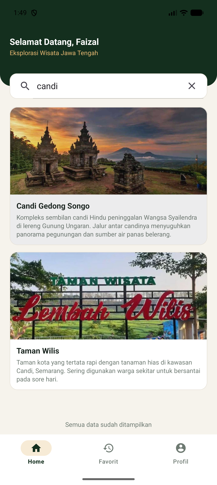 |  |
| Kata kunci `candi` menemukan dua destinasi, satu dari nama wisata dan satu dari deskripsi | Kata kunci yang tidak ada di database menampilkan pesan bahwa wisata tidak ditemukan |

### Halaman Detail

| Mengambil Data (Loading) | Detail Wisata (Success) |
|:---:|:---:|
|  | 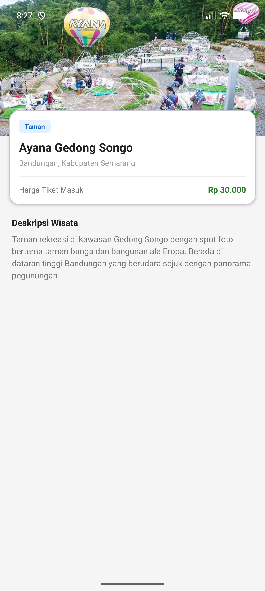 |
| Indikator loading tampil selama data detail diambil dari API | Gambar, kategori, nama wisata, lokasi, harga tiket, dan deskripsi |

| Harga Tiket Gratis | Gagal Memuat (Error) |
|:---:|:---:|
| 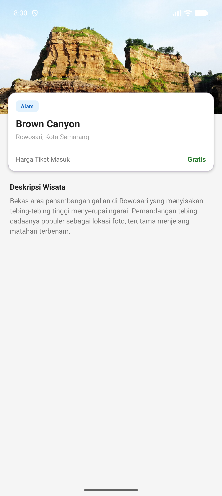 | 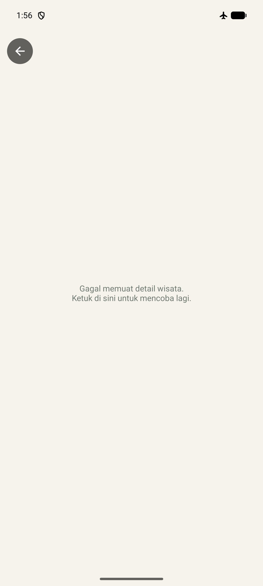 |
| Harga tiket bernilai `0` ditampilkan sebagai `Gratis` | Pesan gagal memuat yang dapat diketuk untuk mencoba lagi |

## Cara Menjalankan

1. **Siapkan folder API**
   Nyalakan **Apache** dan **MySQL** di XAMPP Control Panel, lalu copy folder `login_api` ke `C:\xampp\htdocs\` **beserta folder `uploads` di dalamnya**, sehingga menjadi `C:\xampp\htdocs\login_api\`.

   Alternatif tanpa menyalin file: arahkan Apache langsung ke folder project dengan menambahkan baris berikut di `C:\xampp\apache\conf\httpd.conf`, lalu restart Apache.

   ```apache
   Alias /login_api "D:/path/menuju/TravelDestinationApp/login_api"
   <Directory "D:/path/menuju/TravelDestinationApp/login_api">
       Require all granted
   </Directory>
   ```

2. **Import database**
   Buka `http://localhost/phpmyadmin`, masuk tab **Import**, lalu import dua file secara berurutan:

   | File | Isi |
   |---|---|
   | `login_api/database.sql` | Database `login_register` beserta tabel `users` |
   | `login_api/database_wisata.sql` | Tabel `wisata` beserta 30 datanya |

   Pada tugas ini tabel `wisata` mendapat tiga kolom baru, yaitu `kategori`, `lokasi`, dan `harga_tiket`. Jadi `database_wisata.sql` **perlu diimport ulang** meskipun tabelnya sudah pernah dibuat pada tugas sebelumnya. File tersebut sudah berisi perintah `DROP TABLE IF EXISTS wisata`, sehingga tabel lama otomatis diganti. Tabel `users` tidak ikut terpengaruh.

3. **Sesuaikan alamat server**
   Buka CMD, ketik `ipconfig`, catat **IPv4 Address** laptop, lalu isikan pada `HOST_DEFAULT` di `ApiClient.kt`:

   ```kotlin
   const val HOST_DEFAULT = "192.168.1.5"
   ```

   Alamat ini hanya nilai awal. Ketika aplikasi gagal menghubungi server, muncul dialog **Alamat server** berisi kolom isian: masukkan IP yang baru, tekan **Simpan**, dan permintaan yang gagal langsung diulang. Alamat tersebut tersimpan di `SharedPreferences`, sehingga saat berpindah jaringan WiFi tidak perlu mengubah kode dan memasang ulang aplikasi. Untuk emulator, alamat `10.0.2.2` selalu menunjuk ke laptop yang menjalankannya.

4. **Jalankan aplikasi**
   Run project di Android Studio (emulator maupun HP asli). Daftarkan akun lewat halaman Register, lalu login. Daftar wisata langsung tampil setelah berhasil masuk. Ketik kata kunci di kolom pencarian untuk mencari destinasi, lalu ketuk salah satu kartu untuk membuka halaman detailnya. Kalau memakai HP asli, pastikan HP dan laptop terhubung ke WiFi yang sama.

## Catatan

- Kata kunci dirapikan dengan `URLEncoder` lewat `Helper.sandikan()`, sehingga kata kunci yang mengandung spasi atau tanda baca tetap aman dikirim sebagai bagian dari alamat API.
- Pencarian dan pagination memakai endpoint yang sama. Saat kolom pencarian kosong, parameter `q` ikut dikirim dalam keadaan kosong dan API mengembalikan seluruh data seperti sebelumnya.
- Harga tiket disimpan sebagai angka biasa di database, bukan sebagai teks. Pemberian titik pemisah ribuan dan kata `Gratis` dilakukan di sisi aplikasi lewat `Helper.rupiah()`, supaya data di database tetap mudah diolah.
- Halaman detail memakai `ScrollView` supaya deskripsi yang panjang tetap bisa dibaca seluruhnya pada layar kecil.
- Alamat gambar dibangun memakai `$_SERVER["HTTP_HOST"]`, jadi ketika IP laptop berubah, alamat gambar ikut menyesuaikan sendiri tanpa perlu mengubah isi database.
- Glide menyimpan gambar di cache berdasarkan URL-nya. Jika file di folder `uploads` diganti tanpa mengubah nama, hapus penyimpanan aplikasi di perangkat agar gambar baru diunduh ulang.

---

# Branch `Tugas-3-Implementasi-Pagination`

## Deskripsi

Melanjutkan project **TravelDestinationApp** dengan menambahkan fitur **daftar destinasi wisata di Semarang** menggunakan konsep **pagination**.

Dalam implementasinya, data destinasi ditampilkan secara bertahap agar aplikasi tetap ringan dan nyaman digunakan. Setiap kali pengguna melakukan scroll hingga mendekati bagian bawah daftar, aplikasi akan otomatis memuat data destinasi berikutnya.

Nama wisata dan deskripsinya disimpan di **MySQL**, sedangkan **gambarnya disimpan sebagai file** di folder `login_api/uploads/`. Yang masuk ke database hanyalah **nama filenya** pada kolom `foto`. API kemudian merakit alamat lengkap gambar ke dalam kolom `foto_url`:

```
Folder    :  login_api/uploads/gambar_lawang_sewu.jpg
MySQL     :  foto = "gambar_lawang_sewu.jpg"
API PHP   :  foto_url = "http://<IP_LAPTOP>/login_api/uploads/gambar_lawang_sewu.jpg"
Android   :  Glide.load(foto_url)
```

Cara ini membuat gambar, nama, dan deskripsi selalu sinkron karena penghubungnya adalah kolom di database, bukan tebakan dari nama wisata. Database juga tetap ringan sebab tidak menyimpan berkas gambar.

## Ketentuan Fitur

| # | Ketentuan | Pemenuhan |
|---|---|---|
| 1 | Menampilkan daftar destinasi wisata yang berada di Semarang | 30 destinasi Kota & Kabupaten Semarang, diambil dari tabel `wisata` |
| 2 | Menampilkan 10 item data pada setiap pemuatan | `$per_page = 10` pada `wisata.php`, dibagi menjadi 3 halaman |
| 3 | Scroll mendekati bawah memuat 10 data berikutnya secara otomatis | `OnScrollListener` memanggil `muatData()` saat tersisa 3 item menuju bawah |
| 4 | Menampilkan loading indicator saat pemuatan berlangsung | `pbAwal` di tengah layar saat pemuatan pertama, `pbMuatLagi` di bawah daftar saat memuat halaman berikutnya |
| 5 | Mencegah data yang sama ditampilkan berulang atau duplikat | `idSudahAda`, sebuah `Set` berisi id yang sudah tampil, menyaring data sebelum ditambahkan |
| 6 | Menampilkan informasi ketika seluruh data selesai dimuat | Keterangan "Semua data sudah ditampilkan" muncul saat pengguna sampai di kartu terakhir |
| 7 | Menangani kondisi loading, error, dan data kosong | Ketiganya ditangani, pesan error dapat diketuk untuk memuat ulang, dan saat server tidak terjangkau muncul dialog untuk memperbaiki alamat server |
| 8 | Tampilan responsif, user-friendly, dan mudah digunakan | Kartu `MaterialCardView` dengan gambar, nama, dan deskripsi, mengikuti area aman layar |

## Tujuan

Menerapkan konsep pagination untuk mengoptimalkan proses pemuatan data. Dengan pagination, data destinasi tidak dimuat sekaligus, melainkan secara bertahap.

Tujuannya agar aplikasi tetap ringan, cepat, responsif, dan nyaman digunakan, meskipun jumlah data destinasi wisatanya cukup banyak.

## Cara Kerja Pagination

```
Buka MainActivity
       |
   muatData() halaman 1  -->  ProgressBar tengah tampil
       |
   10 data masuk daftar   -->  halaman = 2
       |
   pengguna menggulir ke bawah
       |
   sisa 3 item menuju bawah?  --> ya --> muatData() halaman 2
       |                                      |
       |                              ProgressBar bawah tampil
       |                                      |
       |                              10 data masuk, halaman = 3
       |
   halaman terakhir terambil
       |
   "Semua data sudah ditampilkan"  -->  pemuatan dihentikan
```

Tiga penanda yang menjaga alur ini tetap benar:

| Penanda | Gunanya |
|---|---|
| `sedangMemuat` | Mencegah permintaan ganda saat satu permintaan masih berjalan |
| `semuaSudahDimuat` | Menghentikan permintaan setelah halaman terakhir terambil |
| `idSudahAda` | Menyaring data yang id-nya sudah pernah tampil, mencegah duplikat |

## Tangkapan Layar

| Loading Pemuatan Pertama | Daftar Wisata | Loading Data Berikutnya |
|:---:|:---:|:---:|
|  |  | 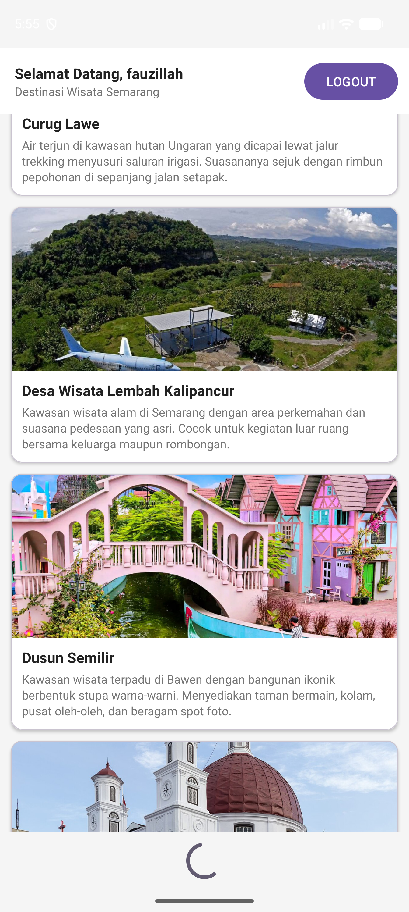 |

| Seluruh Data Selesai Dimuat | Kondisi Gagal Memuat | Dialog Alamat Server |
|:---:|:---:|:---:|
| 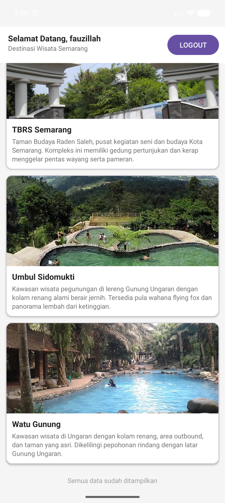 | 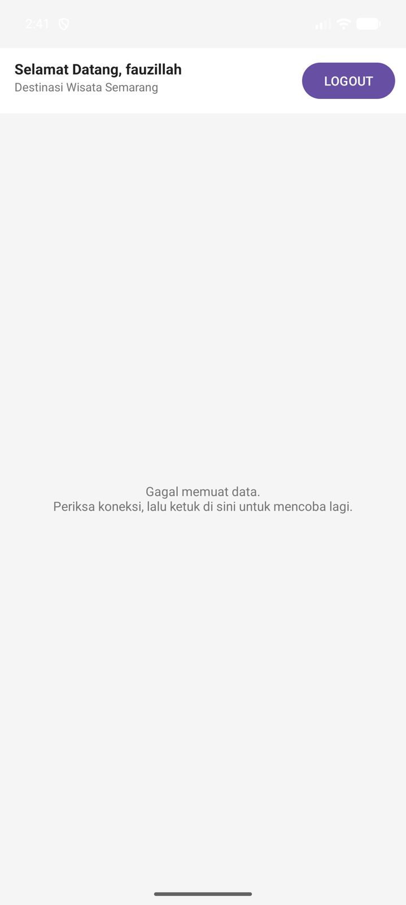 | 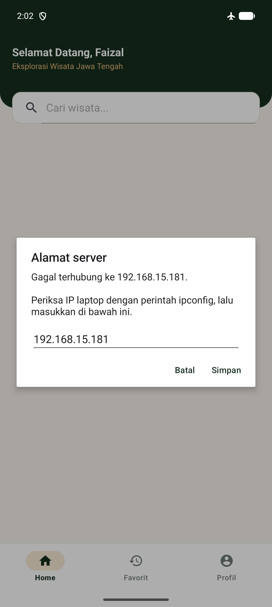 |
| Keterangan muncul setelah kartu terakhir | Pesan gagal yang dapat diketuk untuk memuat ulang | Muncul saat server tidak terjangkau, alamat baru dapat langsung diisi di sini |

## Catatan

- Jumlah data per halaman diatur lewat variabel `$per_page` di `wisata.php`. Mengubah angkanya cukup di satu tempat, sisi Android tidak perlu diubah karena ikut membaca `meta`.
- Nama file gambar disimpan apa adanya di kolom `foto`, lalu dibungkus `rawurlencode()` saat dijadikan URL supaya nama file yang mengandung spasi tetap bisa diakses.
- Destinasi yang dipakai mencakup wilayah Kota Semarang dan Kabupaten Semarang (Ungaran, Bandungan, Ambarawa, Bawen).
- Alamat server disimpan di `SharedPreferences` melalui `ApiClient.simpanHost()`, dan dipakai oleh halaman login, register, maupun daftar wisata. Selama alamat tersebut belum pernah diisi, aplikasi memakai nilai `HOST_DEFAULT`.
