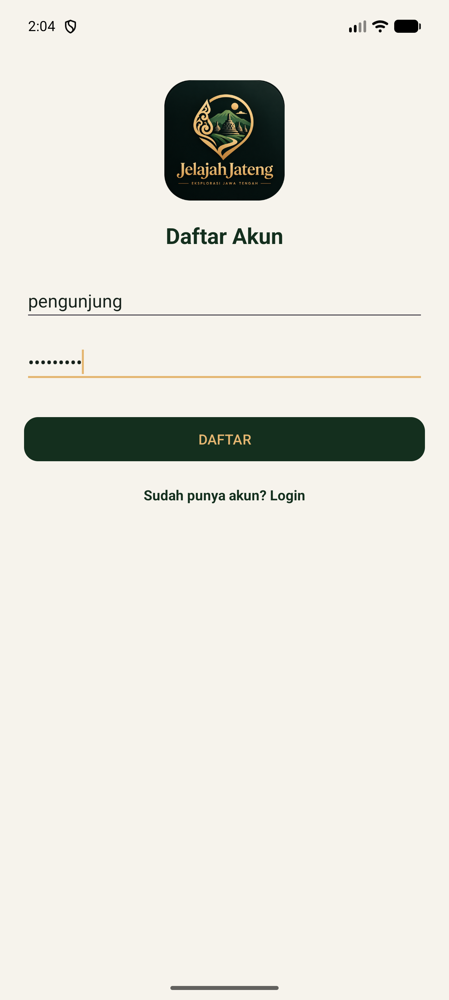
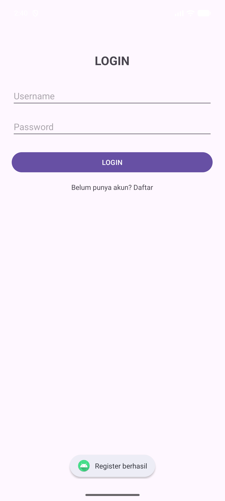
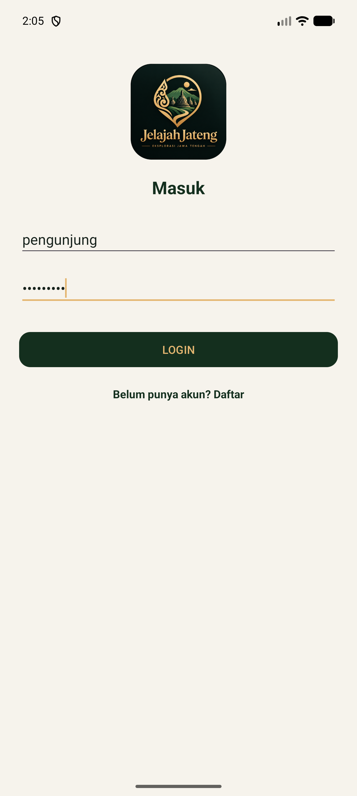
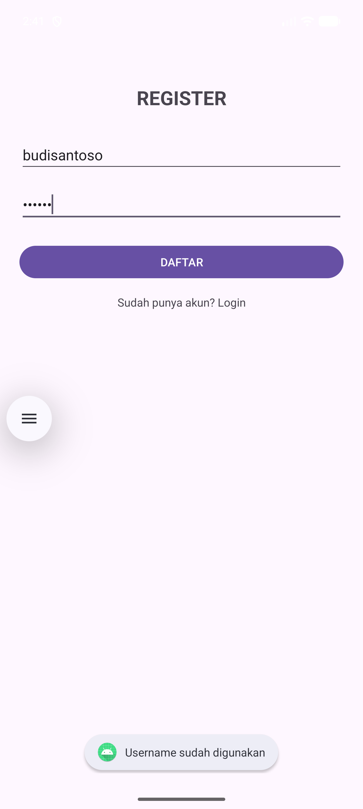

# -TravelDestinationApp

Repository kumpulan tugas magang di Crocodic Semarang. Setiap tugas/fitur dikerjakan pada branch terpisah sesuai nama fiturnya, lalu di-push ke repository ini.

| Branch | Fitur | Status |
|---|---|---|
| `main` | Halaman utama repository | - |
| `login-register` | Halaman Login & Register dengan ConstraintLayout + MySQL | Selesai |
| `Tugas-3-Implementasi-Pagination` | Daftar destinasi wisata Semarang dengan pagination | Selesai |

---

# Branch `login-register`

## Deskripsi

Aplikasi Android sederhana berisi halaman **Login** dan **Register**. Seluruh tampilan dibangun memakai **ConstraintLayout**, dan data akun disimpan di **database MySQL**.

Karena Android tidak bisa (dan tidak boleh) terhubung langsung ke MySQL, aplikasi berkomunikasi dengan database melalui **REST API PHP** yang dijalankan di XAMPP. Alur datanya:

```
Aplikasi Android  ->  API PHP (XAMPP)  ->  Database MySQL
   Kotlin              login_api/           login_register
```

Password tidak disimpan sebagai teks asli, melainkan di-hash memakai `password_hash()` bawaan PHP, sehingga isi kolom password di database tidak bisa dibaca langsung.

## Fitur

- **Register** — mendaftarkan akun baru (username & password) ke tabel `users`
- **Login** — mencocokkan username & password dengan data di MySQL
- **Beranda** — menampilkan sapaan berisi username yang berhasil masuk
- **Logout** — kembali ke halaman login
- **Validasi input** — data kosong, panjang username 3-20 karakter, username hanya boleh huruf/angka/underscore, password minimal 6 karakter, username sudah terdaftar, serta username/password salah saat login

## Teknologi

| Bagian | Teknologi |
|---|---|
| Bahasa aplikasi | Kotlin |
| Tampilan | ConstraintLayout, Material Components |
| Koneksi jaringan | `HttpURLConnection` (POST, form-urlencoded) |
| Parsing data | `org.json.JSONObject` |
| Backend | PHP 8 (`mysqli` + prepared statement) |
| Database | MySQL / MariaDB (XAMPP) |
| minSdk / targetSdk | 24 / 37 |

## Struktur File

```
Tugas2_LoginRegister/
├── app/src/main/
│   ├── java/com/example/tugas2_loginregister/
│   │   ├── ApiClient.kt          -> pengirim data ke API PHP
│   │   ├── LoginActivity.kt      -> halaman login
│   │   ├── RegisterActivity.kt   -> halaman register
│   │   └── MainActivity.kt       -> halaman beranda
│   ├── res/layout/
│   │   ├── activity_login.xml    -> tampilan login (ConstraintLayout)
│   │   ├── activity_register.xml -> tampilan register (ConstraintLayout)
│   │   └── activity_main.xml     -> tampilan beranda (ConstraintLayout)
│   └── AndroidManifest.xml
├── login_api/                    -> salin ke C:\xampp\htdocs\
│   ├── koneksi.php               -> koneksi ke MySQL
│   ├── register.php              -> menyimpan user baru
│   ├── login.php                 -> mengecek username & password
│   └── database.sql              -> struktur database
└── screenshot/                   -> tangkapan layar aplikasi
```

## Database

Database: `login_register` — tabel: `users`

| Kolom | Tipe | Keterangan |
|---|---|---|
| `id` | INT(11) | Primary key, auto increment |
| `username` | VARCHAR(50) | Unique, tidak boleh sama |
| `password` | VARCHAR(255) | Disimpan dalam bentuk hash |
| `created_at` | TIMESTAMP | Otomatis terisi saat mendaftar |

Struktur lengkapnya ada di `login_api/database.sql`.

## API

Base URL: `http://<IP_LAPTOP>/login_api/`

| Endpoint | Method | Parameter | Response berhasil |
|---|---|---|---|
| `register.php` | POST | `username`, `password` | `{"success":true,"message":"Register berhasil"}` |
| `login.php` | POST | `username`, `password` | `{"success":true,"message":"Login berhasil","user_id":1,"username":"budi"}` |

Response gagal selalu berbentuk `{"success":false,"message":"<alasan>"}`, dan pesan itulah yang ditampilkan aplikasi lewat Toast.

## Alur Aplikasi

```
LoginActivity  --klik "Daftar"-->  RegisterActivity
                                        |
                                   isi data, klik DAFTAR
                                        |
                                   tersimpan di MySQL
                                        |
                                   kembali ke LoginActivity
                                        |
                              isi data, klik LOGIN (dicek ke MySQL)
                                        |
                                   MainActivity (beranda)
                                        |
                                  klik LOGOUT -> LoginActivity
```

## Tangkapan Layar

| Halaman Login | Halaman Register | Register Terisi |
|:---:|:---:|:---:|
|  |  |  |

| Daftar Berhasil | Login Terisi | Beranda |
|:---:|:---:|:---:|
|  |  |  |

| Contoh Validasi (username sudah dipakai) |
|:---:|
|  |

## Cara Menjalankan

1. **Salin folder API**
   Copy folder `login_api` ke `C:\xampp\htdocs\` sehingga menjadi `C:\xampp\htdocs\login_api\`

2. **Buat database**
   Nyalakan **Apache** dan **MySQL** di XAMPP Control Panel, buka `http://localhost/phpmyadmin`, masuk tab **Import**, pilih file `login_api/database.sql`, lalu klik **Go**

3. **Sesuaikan alamat API**
   Buka CMD, ketik `ipconfig`, catat **IPv4 Address** laptop (contoh `192.168.1.5`). Ubah baris berikut di `ApiClient.kt`:

   ```kotlin
   const val BASE_URL = "http://192.168.1.5/login_api/"
   ```

4. **Jalankan aplikasi**
   Run project di Android Studio (emulator maupun HP asli). Kalau memakai HP asli, pastikan HP dan laptop terhubung ke WiFi yang sama.

## Catatan

- Alamat pada `BASE_URL` memakai IP laptop, bukan `10.0.2.2`, supaya aplikasi bisa dijalankan di emulator maupun HP asli tanpa mengubah kode. **IP ini berubah saat berpindah jaringan WiFi**, jadi perlu disesuaikan kembali lewat `ipconfig`.
- Apache dan MySQL di XAMPP harus dalam keadaan menyala saat aplikasi dijalankan. Jika tidak, akan muncul Toast "Gagal terhubung ke server".
- Password pada database berbentuk hash (acak), bukan teks asli. Ini normal dan memang disengaja demi keamanan.

---

# Branch `Tugas-3-Implementasi-Pagination`

## Deskripsi

Melanjutkan project **TravelDestinationApp** dengan menambahkan fitur **daftar destinasi wisata di Semarang** menggunakan konsep **pagination**.

Dalam implementasinya, data destinasi ditampilkan secara bertahap agar aplikasi tetap ringan dan nyaman digunakan. Setiap kali pengguna melakukan scroll hingga mendekati bagian bawah daftar, aplikasi akan otomatis memuat data destinasi berikutnya.

Nama tempat wisata dan deskripsinya disimpan di database MySQL, sedangkan gambarnya disimpan di folder `uploads` lalu dipanggil dan disinkronkan dengan data di MySQL.

Nama wisata dan deskripsinya disimpan di **MySQL**, sedangkan **gambarnya disimpan sebagai file** di folder `login_api/uploads/`. Yang masuk ke database hanyalah **nama filenya** pada kolom `foto`. API kemudian merakit alamat lengkap gambar ke dalam kolom `foto_url`:

```
Folder    :  login_api/uploads/gambar_lawang_sewu.jpg
MySQL     :  foto = "gambar_lawang_sewu.jpg"
API PHP   :  foto_url = "http://<IP_LAPTOP>/login_api/uploads/gambar_lawang_sewu.jpg"
Android   :  Glide.load(foto_url)
```

Cara ini membuat gambar, nama, dan deskripsi selalu sinkron karena penghubungnya adalah kolom di database, bukan tebakan dari nama wisata. Database juga tetap ringan sebab tidak menyimpan berkas gambar.

## Ketentuan Fitur

| # | Ketentuan | Pemenuhan |
|---|---|---|
| 1 | Menampilkan daftar destinasi wisata yang berada di Semarang | 30 destinasi Kota & Kabupaten Semarang, diambil dari tabel `wisata` |
| 2 | Menampilkan 10 item data pada setiap pemuatan | `$per_page = 10` pada `wisata.php`, dibagi menjadi 3 halaman |
| 3 | Scroll mendekati bawah memuat 10 data berikutnya secara otomatis | `OnScrollListener` memanggil `muatData()` saat tersisa 3 item menuju bawah |
| 4 | Menampilkan loading indicator saat pemuatan berlangsung | `pbAwal` di tengah layar saat pemuatan pertama, `pbMuatLagi` di bawah daftar saat memuat halaman berikutnya |
| 5 | Mencegah data yang sama ditampilkan berulang atau duplikat | `idSudahAda`, sebuah `Set` berisi id yang sudah tampil, menyaring data sebelum ditambahkan |
| 6 | Menampilkan informasi ketika seluruh data selesai dimuat | Keterangan "Semua data sudah ditampilkan" muncul saat pengguna sampai di kartu terakhir |
| 7 | Menangani kondisi loading, error, dan data kosong | Ketiganya ditangani, pesan error dapat diketuk untuk memuat ulang |
| 8 | Tampilan responsif, user-friendly, dan mudah digunakan | Kartu `MaterialCardView` dengan gambar, nama, dan deskripsi, mengikuti area aman layar |

## Tujuan

Menerapkan konsep pagination untuk mengoptimalkan proses pemuatan data. Dengan pagination, data destinasi tidak dimuat sekaligus, melainkan secara bertahap.

Tujuannya agar aplikasi tetap ringan, cepat, responsif, dan nyaman digunakan, meskipun jumlah data destinasi wisatanya cukup banyak.

## Teknologi Tambahan

| Bagian | Teknologi |
|---|---|
| Daftar data | `RecyclerView` + `LinearLayoutManager` |
| Tampilan kartu | `MaterialCardView` |
| Memuat gambar | Glide 4.16.0 |
| Deteksi scroll | `RecyclerView.OnScrollListener` |
| Koneksi jaringan | `HttpURLConnection` (GET) |

## Struktur File Tambahan

```
TravelDestinationApp/
├── app/src/main/
│   ├── java/com/example/tugas2_loginregister/
│   │   ├── Wisata.kt              -> data satu destinasi wisata
│   │   ├── WisataAdapter.kt       -> mengubah data menjadi kartu di layar
│   │   ├── MainActivity.kt        -> daftar wisata + logika pagination
│   │   └── ApiClient.kt           -> ditambah fungsi get()
│   └── res/layout/
│       ├── activity_main.xml      -> daftar, loading, dan pesan
│       └── item_wisata.xml        -> tampilan satu kartu wisata
└── login_api/
    ├── wisata.php                 -> API pagination
    ├── database_wisata.sql        -> struktur + 30 data wisata
    └── uploads/                   -> 30 file gambar wisata
```

## Database

Database: `login_register` — tabel: `wisata`

| Kolom | Tipe | Keterangan |
|---|---|---|
| `id` | INT(11) | Primary key, auto increment |
| `nama_wisata` | VARCHAR(100) | Nama destinasi wisata |
| `deskripsi` | TEXT | Penjelasan singkat destinasi |
| `foto` | VARCHAR(255) | **Nama file** gambar di folder `uploads`, bukan gambarnya |
| `created_at` | TIMESTAMP | Otomatis terisi saat data dibuat |

Struktur beserta 30 datanya ada di `login_api/database_wisata.sql`.

## API

| Endpoint | Method | Parameter | Keterangan |
|---|---|---|---|
| `wisata.php` | GET | `page` (default `1`) | Mengembalikan 10 data per halaman |

Contoh: `http://<IP_LAPTOP>/login_api/wisata.php?page=2`

```json
{
  "success": true,
  "message": "Data berhasil diambil",
  "data": [
    {
      "id": 1,
      "nama_wisata": "Ayana Gedong Songo",
      "deskripsi": "Taman rekreasi di kawasan Gedong Songo ...",
      "foto": "gambar_ayana_gedong_songo.jpg",
      "foto_url": "http://192.168.18.154/login_api/uploads/gambar_ayana_gedong_songo.jpg"
    }
  ],
  "meta": {
    "total_data": 30,
    "total_page": 3,
    "current_page": 1,
    "per_page": 10
  }
}
```

Bagian `meta` inilah yang dipakai aplikasi untuk tahu kapan harus berhenti memuat: kalau `current_page` sudah sama dengan `total_page`, berarti data sudah habis.

## Cara Kerja Pagination

```
Buka MainActivity
       |
   muatData() halaman 1  -->  ProgressBar tengah tampil
       |
   10 data masuk daftar   -->  halaman = 2
       |
   pengguna menggulir ke bawah
       |
   sisa 3 item menuju bawah?  --> ya --> muatData() halaman 2
       |                                      |
       |                              ProgressBar bawah tampil
       |                                      |
       |                              10 data masuk, halaman = 3
       |
   halaman terakhir terambil
       |
   "Semua data sudah ditampilkan"  -->  pemuatan dihentikan
```

Tiga penanda yang menjaga alur ini tetap benar:

| Penanda | Gunanya |
|---|---|
| `sedangMemuat` | Mencegah permintaan ganda saat satu permintaan masih berjalan |
| `semuaSudahDimuat` | Menghentikan permintaan setelah halaman terakhir terambil |
| `idSudahAda` | Menyaring data yang id-nya sudah pernah tampil, mencegah duplikat |

## Tangkapan Layar

| Loading Pemuatan Pertama | Daftar Wisata | Loading Data Berikutnya |
|:---:|:---:|:---:|
|  |  |  |

| Seluruh Data Selesai Dimuat | Kondisi Gagal Memuat |
|:---:|:---:|
|  |  |

## Cara Menjalankan

1. **Siapkan folder API**
   Sama seperti branch sebelumnya, copy folder `login_api` ke `C:\xampp\htdocs\` **beserta folder `uploads` di dalamnya**.

   Alternatif tanpa menyalin file: arahkan Apache langsung ke folder project dengan menambahkan baris berikut di `C:\xampp\apache\conf\httpd.conf`, lalu restart Apache.

   ```apache
   Alias /login_api "D:/path/menuju/TravelDestinationApp/login_api"
   <Directory "D:/path/menuju/TravelDestinationApp/login_api">
       Require all granted
   </Directory>
   ```

2. **Import database wisata**
   Buka `http://localhost/phpmyadmin`, masuk tab **Import**, pilih `login_api/database_wisata.sql`, klik **Go**. File ini membuat tabel `wisata` sekaligus mengisi 30 datanya.

3. **Sesuaikan alamat API**
   Ubah `BASE_URL` di `ApiClient.kt` sesuai IP laptop (lihat lewat `ipconfig`).

4. **Jalankan aplikasi**
   Login seperti biasa, daftar wisata akan langsung tampil di beranda.

## Catatan

- Jumlah data per halaman diatur lewat variabel `$per_page` di `wisata.php`. Mengubah angkanya cukup di satu tempat, sisi Android tidak perlu diubah karena ikut membaca `meta`.
- Alamat gambar dibangun memakai `$_SERVER["HTTP_HOST"]`, jadi ketika IP laptop berubah, alamat gambar ikut menyesuaikan sendiri tanpa perlu mengubah isi database.
- Nama file gambar disimpan apa adanya di kolom `foto`, lalu dibungkus `rawurlencode()` saat dijadikan URL supaya nama file yang mengandung spasi tetap bisa diakses.
- Destinasi yang dipakai mencakup wilayah Kota Semarang dan Kabupaten Semarang (Ungaran, Bandungan, Ambarawa, Bawen).
